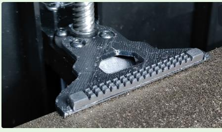
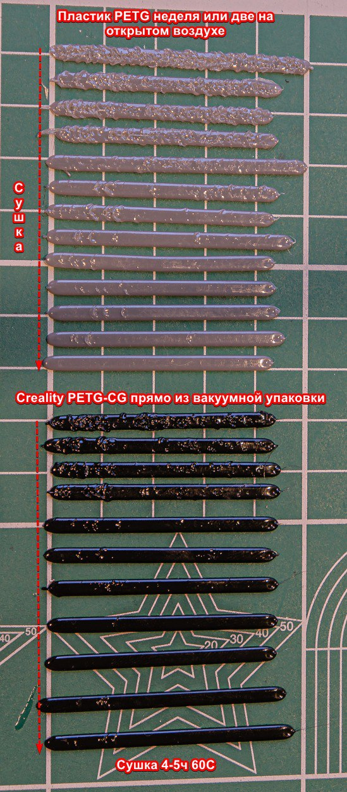
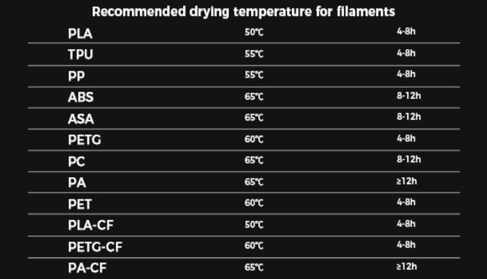
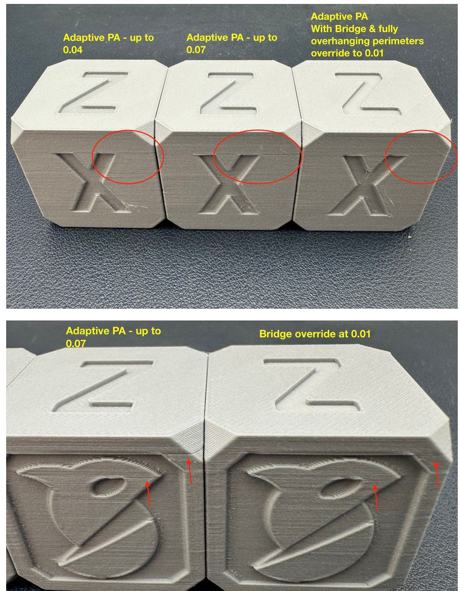

<h5 align="right">поставьте "звездочку" проекту. так другим пользователям легче его найти.</h5>


**Дополнительные материалы к лекциям.**


1. прокладка под экран которая уменьшает приток холодного воздуха в камеру принтера. 

[**скачать модель тут для K1MAX**](https://www.printables.com/model/553930-creality-k1-max-door-cover)

[**скачать модель тут для K1\K1C**](https://t.me/crealityK1rus/16778/293569)


2. Проставка для улучшения вентиляции. Устанавливается между корпусом и крышкой.

[**скачать модель тут для K1\K1C**](https://www.printables.com/model/525295-jc-creality-k1-hinged-lid-riser)

[**скачать модель тут для K1MAX**](https://t.me/crealityK1rus/16778/109114)


[**модель держалки резинки прочистки для K1C**](https://t.me/crealityK1rus/16778/217607)





[**скачать обычный тестовый кубик**](Cube.stl)


**Методы устранения перекоса стола**

[**текстовый мануал**](/random/before_use.md)

[**видеопояснение**](https://t.me/crealityK1rus/16778/130457)

**Что такое шейперы и с чем их едят:**


[**Большой заумный материал**](https://github.com/Tombraider2006/klipperFB6/tree/main/accel_graph)

[**Большой заумный материал на английском**](https://github.com/Frix-x/klippain-shaketune/blob/main/docs/macros/axes_shaper_calibrations.md)

[**как понять по графику надо ли лезть в механику принтера creality K1\K1c\K1max**](/shaper/readme.md)


[**Регулировка натяжения ремней опираясь на графики**](/random/belts/readme.md)

[**Разное полезное про меню Helper Script**](/random/menu.md)

**порядок калибровки пластика**
1. поток
2. [Linear Advance](https://k3d.tech/calibrations/la/calibrator/)
3. [Тест откатов](https://k3d.tech/calibrations/retractions/calibrator/)
4. Температура
5. Максимальная объемная скорость.

в тестах соркина не забываем поставить правильные начальные и конечные джикоды.

**стартовый код**

```
_FULL_BED_MESH_ON
_ADAPTIVE_PURGE_LINE_OFF
START_PRINT EXTRUDER_TEMP=$HOTTEMP BED_TEMP=$BEDTEMP

```
**конечный код**

```
SET_PIN PIN=FULL_BED_MESH VALUE=0
_ADAPTIVE_PURGE_LINE_ON
END_PRINT

```


**Что посмотреть на ютубчике**

[**Почему OrcaSlicer**](https://youtu.be/0TzEFStKH90?si=3XKylqedC36pHxEK)

[**OrcaSlicer - Установка, Настройка, Работа с программой**](https://youtu.be/LeLj5oCacak?si=SBsEC19GKPhX8TuF)

[**калибровка точности с помощью OrcaSlicer**](https://youtu.be/xzC4Fdf7mDU?si=dvUSbCUAnS6y5BpE)

[**Все о филаментах**](https://www.youtube.com/watch?v=CzgOCkJbcxE)

[**Калибровка точности по Соркину**](https://youtu.be/6seFEWIGTtU?si=9I6r6bh5QEWTt1Us)

[**Важен ли диаметр сопла? Насколько 0,6 производительнее 0,4?**](https://youtu.be/sNIYDhxbMe4?si=B41wK4Hl-1oPrVQ_)


[**Приемы 3D моделирования для эффективной 3D печати**](https://youtu.be/64Ce6Of0N2Q?si=uoQyqhyEkVIPD1hb)


**по поводу влажности пластика и как ее определить**

один из пользователей  сфоткал полоски Line Purge которые делает KAMP



дополнительно распаковал пластик от креалити и оказалось что он влажный, хотя был в заводской вакуумной упаковке и с силикагелем. пока сушил сделал еще несколько полосок

Рекомендация по сушке филамента от Creality




**Расходные жижи:**
- Клей для FDM 3D печати
- Смазка для 3D принтеров
- Композитные полимерные материалы для 3D печати
- Матирующие спреи для 3D сканирования

 заказать можно через бот **@ATECOBot** штучно на озоне часто выходит дешевле, но через бота накопительная скидка [вот официальная группа](https://t.me/atecoru)

 **Пластики:**
 
 *АБС* - [hi-tech-plast](https://www.ozon.ru/category/plastik-dlya-3d-printera-15794/hi-tech-plast-87286623/)
 
 *PETG* - [mako](https://www.ozon.ru/brand/mako-100524697/)

 *PLA* - [Erione](https://www.ozon.ru/category/plastik-dlya-3d-printera-15794/eryone-100430904/) 

**Немного про adaptive PA**

Разработчики орки наконец-то заметили эту проблему, которая была кажется у всех

по мнению разработчиков проблема в том что на мостах откалиброванный ПА вооще не применим, сопло слишком быстро теряет давление, т.к. экструзия происходит в воздух и как следствие когда возвращается на стенку, то требуется некоторое время чтобы вернуть потерянное давление, отсюда получается полоса сразу после моста.
разработчики похоже добавят отдельную настройку, управляющую ПА на мостах
функция названа - PA bridge override и она сразу разрабатывается вместе с другой новой функцией adaptive PA, которая меняет ПА при изменениях объемного потока

в клиппере тоже происходят изменения, связанные с ПА на нависаниях, проблема там похожей природы (проблема называется PA change stutter - вызывает дефекты на стенках при работе ПА при выходе из нависаний)




