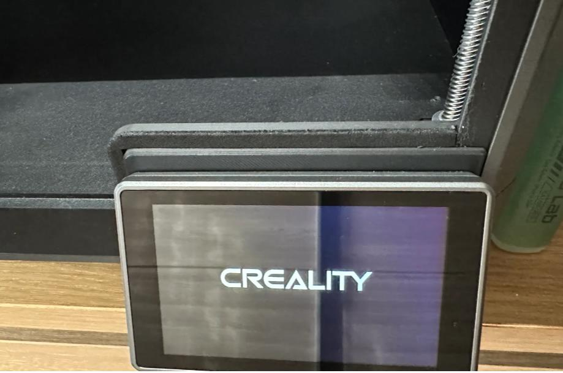
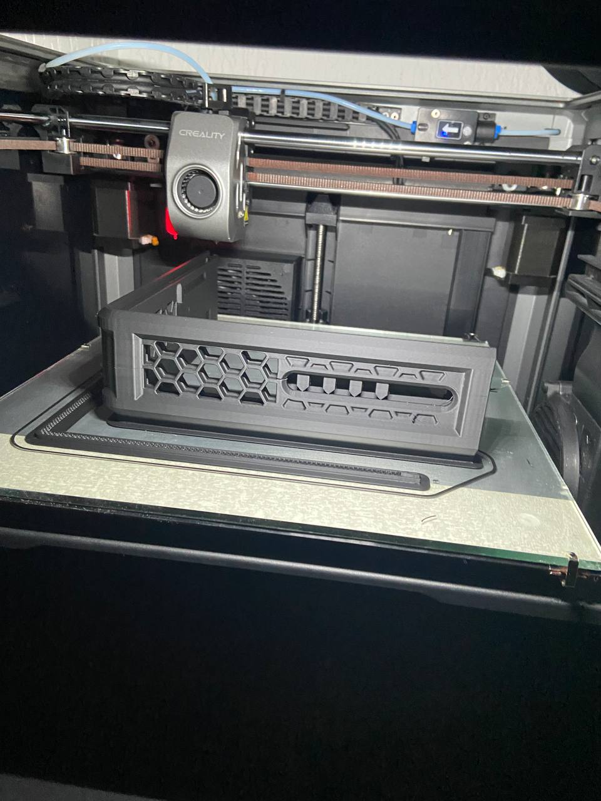
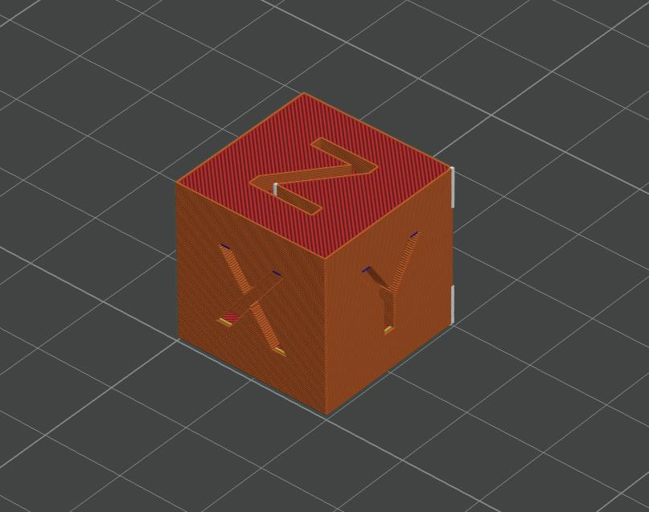
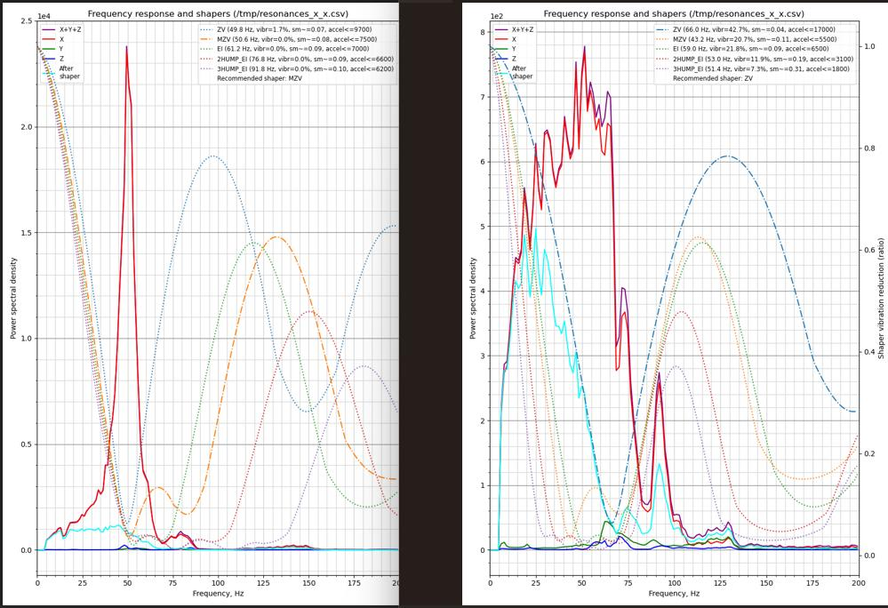

**Дополнительные материалы к лекциям.**

**Для КМАКС:**

1. прокладка под экран которая уменьшает приток холодного воздуха в камеру принтера. 

[**скачать модель тут**](https://www.printables.com/model/553930-creality-k1-max-door-cover)

2. Проставка для улучшения вентиляции. Устанавливается между корпусом и крышкой.

[**скачать модель тут**](raizerKMAX.zip)

[**скачать обычный тестовый кубик**](Cube.stl)

**Методы устранения перекоса стола**

[**текстовый мануал**](https://github.com/Tombraider2006/K1/blob/main/before_use.md)

[**видеопояснение**](tablemoving.mp4)

**Что такое шейперы и с чем их едят:**

[**Большой заумный материал**](https://github.com/Tombraider2006/klipperFB6/tree/main/accel_graph)

[**Большой заумный материал на английском**](https://github.com/Frix-x/klippain-shaketune/blob/main/docs/macros/axes_shaper_calibrations.md)

[**как понять по графику надо ли лезть в механику принтера creality K1\K1c|Kmax**](https://github.com/Tombraider2006/K1/tree/main/shaper)

[**Разное полезное про прошивку и тесты**](https://github.com/Tombraider2006/K1/tree/main/version_config)

**Что посмотреть на ютубчике**

[**Почему OrcaSlicer**](https://youtu.be/0TzEFStKH90?si=3XKylqedC36pHxEK)

[**OrcaSlicer - Установка, Настройка, Работа с программой**](https://youtu.be/LeLj5oCacak?si=SBsEC19GKPhX8TuF)

[**калибровка точности с помощью OrcaSlicer**](https://youtu.be/xzC4Fdf7mDU?si=dvUSbCUAnS6y5BpE)

**Расходные жижи:**
- Клей для FDM 3D печати
- Смазка для 3D принтеров
- Композитные полимерные материалы для 3D печати
- Матирующие спреи для 3D сканирования

 заказать можно через бот **@ATECOBot** штучно на озоне часто выходит дешевле, но через бота накопительная скидка [вот официальная группа](https://t.me/atecoru)

 **Пластики:**
 
 *АБС* - [hi-tech-plast](https://www.ozon.ru/category/plastik-dlya-3d-printera-15794/hi-tech-plast-87286623/)
 
 *PETG* - [mako](https://www.ozon.ru/brand/mako-100524697/)

 *PLA* - [Erione](https://www.ozon.ru/category/plastik-dlya-3d-printera-15794/eryone-100430904/) 

