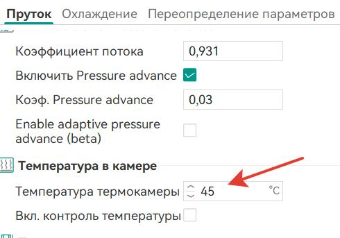
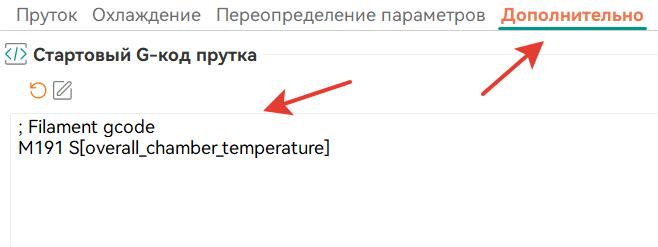
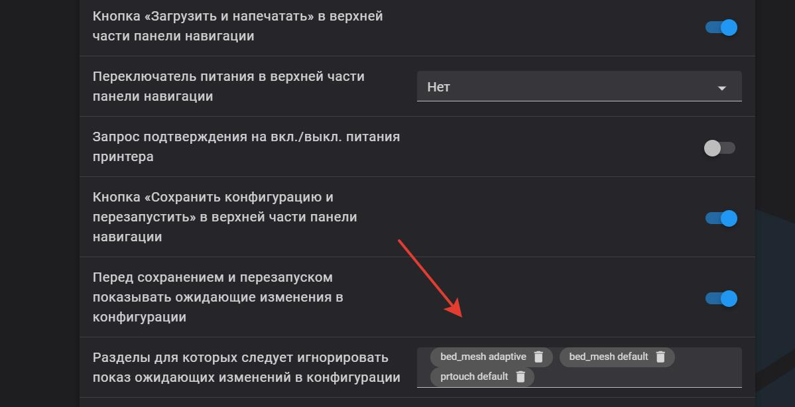

<h3 align="right"><a href="https://www.tinkoff.ru/rm/yakovleva.irina203/51ZSr71845" target="_blank">ваше "спасибо" автору</a></h3>
<h3 align="right"><a href="https://t.me/tombraider2006" target="_blank">телеграм канал автора</a></h3>
<h5 align="right">поставьте "звездочку" проекту. так другим пользователям легче его найти.</h5>

**советы по организации фермы из принтеров creality K серии**

Организуя 3д ферму хочется упростить себе жизнь  и максимально облегчить управление принтерами. в первую очередь это создание одного файла  для возможности печати на разных принтерах.

мы будем рассматривать на примере слайсера орка. однако советы будут работать и на других современных слайсерах.

**0. установка модифицированного ПО**

Родная веб панель от Creality не имеет возможности доступа к файлам конфигурации и в принципе весьма бедна по фукционалу, поэтому прежде чем обсуждать остальные модификации  необходимо установить надстройку по [этому мануалу](/version_config/readme.md)

**1. регулируем шаги экструдера.**

   Важно понимать что если у вас 1 принтер вы можете игнорировать этот пункт и просто подогнать коофициент потока в вашем слайсере и это не будет какой то проблемой, однако если вы нарезаете один раз файл и отправите на разные принтеры с неотрегулированным шагом экструдера это может стать  причиной некачественной печати. все фидеры К серии суть один и тот же с небольшими нюансами.  один из самых простых способов проверки будет описан тут. итак открутим 3 винта на голове нашего принтера и снимем фидер вытащив его вверх.(не забудьте перед этим извлечь филамент) 


  
   1. В `printer.cfg` в конец раздела `[extruder]` добавим строку `min_extrude_temp: 0`  - это позволит выдавливать пруток без включения нагревателя. Строка временная, потом можно удалить.
   
   2. `rotation_distance: 6.9`  значение по умолчанию  используем как отправную точку для расчетов. 
     
   3. заправляем пруток, так чтобы он вышел наружу снизу и откусываем его вровень с корпусом.
   
   4. В консоли пишем :
   
```
    G91
    G1 E300 F60
```
Это выдавит 300 мм прутка на обычной скорости экструдера.(такой расчет достаточно точный и рекомендуемый но медленный)

   5. Берем свой rotation_distance = 6.9 и делю на 300 (столько я отправил прутка на продавливание) 
    получаю Х и это число умножаю на фактически вылезший пруток. Такой нехитрой формулой получаем свой `rotation_distance` идеальный именно для этого принтера. значение может колебаться в небольших пределах.

**2. настройка ретрактов**

подробное описание настроек есть в [**мануале**](/retract/readme.md)

**3. называем принтеры правильно. настраиваем цветовую схему**

В слайсере присваиваем каждому из принтеров порядковый номер.  можно распечатать номера и приклеить на каждый из принтеров и если их меньше 5 можно ввести цветовую индетификацию дополнительно в темах того же fluid  выбрав похожую. 


**4 Преднагрев камеры перед печатью**

в данном случае задача была максимально быстро нагнать необходимую температуру предварительно отогнав в угол голову.
я добавил еще опускание стола вниз для более полного прогрева.  по умолчанию стол в момент работы макроса нагревается до 100 градусов температура камеры целевая 42 градуса. данный макрос можно внести в слайсер в разделе стартового кода.

```
[gcode_macro chamber_hot]
description: hot temp in chamber
gcode:
  
    RESPOND TYPE=command MSG="Homing..."
    G28
  
  
  
  
  G1 X{POSITION_X} Y{POSITION_Y} F6000
  G1 Z{POSITION_Z}
  M84
  M106 P0 S200
  M106 P2 S80
  SET_TEMPERATURE_FAN_TARGET TEMPERATURE_FAN=chamber_fan TARGET={params.CHAMBER_TEMP|default(42)}
  M190 S{params.BED_TEMP|default(100)}

```
<h3>вариант 2.</h3>

для того чтобы не ждать набора температура в камере перед печатью но данные о температуре передавались  можно в профиле пластика добавить: 

```
M141 S{overall_chamber_temperature}
```
получится как то так (как оказалось нужен именно М141 а не М191 как указано на скриншоте)






на первый слоях теперетаура камеры не так важна, так как окружающие потоки воздуха от стола создают теплую рубашку, а к той высоте когда это становится критично уже наберется температура в камере. 

**5 Изменение количества точек теста стола - больше 36**

При попытке увеличить количество точек для более точной карты стола возникает непонятная ошибка, утверждающая, что увеличить количество точек невозможно

Для настройки bed_mesh требуется доступ к файлам конфигурации - см. выше. Обязательно сделайте резервную копию файла конфигурации перед внесением изменений!

A: Модуль prtouch, отвечающий за построение карты стола, жёстко ограничен 36 точками, для каждой из которых прописана калибровка граничных показателей веса. Однако, хоть и не рекомендуется так делать - можно отключить это ограничение, но для этого придётся сильно переписать раздел [prtouch_v2].
В первую очередь, нужно изменить поле pr_version на 1:

```
[prtouch_v2]
pr_version: 1
```

Затем, нужно удалить все строчки, начинающиеся на `tri_min_hold` и `tri_max_hold` - это строки с `tri_min_hold_1` до `tri_min_hold_36` и с `tri_max_hold_1` до `tri_max_hold_36` - это как раз параметры с ограничениями веса. Их легко найти по китайским иероглифам :D
С указанной версией 1 prtouch выведет их сам. Остальные строчки, сколько там их есть - оставьте как есть.

После этих изменений, можно в секции [bed_mesh] указать любой размер карты стола - например, для карты с 8*8 точек:

```
[bed_mesh]
algorithm: bicubic
probe_count: 8,8
```


**6 Настрока звуковых сигналов на к1\К1Макс(в к1с нет бипера как и в совсем новых к1\кмакс)**

Если вы при установке через хелпер скрипт установили `buzzer support`  то вам доступны следующие сценарии: 

1. звуковая сигнализация при окончании филамента. Для этого достаточно зайти в `printer.cfg` найти раздел `[filament_switch_sensor filament_sensor]`
и в конце раздела написать `beep` как на скриншоте ниже. или просто заменить раздел на это:

```
[filament_switch_sensor filament_sensor]
pause_on_runout: true
switch_pin: !PC15
runout_gcode:
  
    G91
    G0 E30 F600
    G90
  
  beep
  beep
```


2. звуковая сигнализация при окончании печати. Идем в файл `gcode_macro.cfg`  и находим макрос `END_PRINT` меняя его следующим образом:

```
[gcode_macro END_PRINT]
gcode:
  Qmode_exit
  EXCLUDE_OBJECT_RESET
  PRINT_PREPARE_CLEAR
  M220 S100
  SET_VELOCITY_LIMIT ACCEL=5000 ACCEL_TO_DECEL=2500
  TURN_OFF_HEATERS
  M107 P1
  M107 P2
  END_PRINT_POINT
  beep
  WAIT_TEMP_START
  M84
```
если необходимо  подавать сигнал подольше, просто добавляем количество `beep` в макрос.

выдает звуковой сигнал при ошибках печати. работает не во всех случаях но работает.

```
[virtual_sdcard]
path: /usr/data/printer_data/gcodes
on_error_gcode: # добавляем чтоб пикало при ошибках
  beep
  beep
  beep

```


**7. Убираем раздражающие напоминания "сохранить и перегрузить" от временной карты стола** 

После печати принтер предлагает сохранить временную карту стола. Так как мы пользуемся KAMP которая делает карту только части стола для печати наших моделей это нам совсем не нужно.  заходим в настройки нашей вебпанели и в самом начале находим "Разделы для которых следует игнорировать показ ожидающих изменений в конфигурации" и вписываем туда `bed_mesh default` `bed_mesh adaptive` `prtouch default` должно получится как то так:



