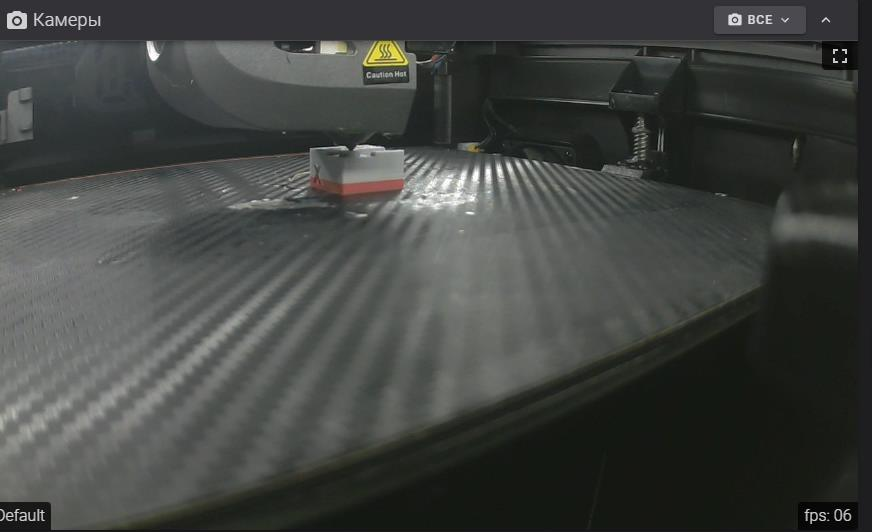

**Макрос смены филамента**

Смена филамента на определенном слое это красиво нужно и полезно, однако чтобы все сделать правильно нам придется потрудится чтобы у нас получилось так:


в макросе  расписаны дополнительные алиасы так что он будет реагировать на любые слайсеры и понимать команды на смену филамента даже марлина. 

если вы полбзуетесь Creality Print я вам сочуствую но есть выход - сохраняем файл на диск открываем в любом редакторе и жмем найти. там пишем `;LAYER:30` где 30 это номер слоя на котором нам нужно сменить филамент. переходим к это строке и над ней пишем `M600` 

При достижении этого слоя принтер встанет на паузу отъедет в левую сторону выгрузит филамент, пропищит о необходимости смены филамента. Через три минуты принтер попытается загрузить филамент в конце пропищит о том что можно снять выдавленные сопельки). Если вы проспали то ничего страшного, можно из меню принтера нажать `Выдавить` после всех операций во флюиде нажимаем `resume` в макросах.  

**А теперь приступим к установке.**

Первая задача хоть и необязательная но сильно желательна к выполнению, научим наш принтер звать на помощь с помощью встроенного зуммера.

Так как он не на MCU что конечно странно. ну да ладно. первое что нам понадобится это зайти по ssh на наш принтер и выполнить следующие команды

```
wget -P /usr/share/klipper/klippy/extras/ https://raw.githubusercontent.com/Tombraider2006/K1/main/filament/gcode_shell_command.py
wget -P /usr/data/printer_data/config/ https://raw.githubusercontent.com/Tombraider2006/K1/main/filament/11.wav
wget -P /usr/data/printer_data/config/  https://raw.githubusercontent.com/Tombraider2006/K1/main/filament/filament.cfg
```
После этого заходим в `printer.cfg` и вписываем следующие строки: 

```
[gcode_shell_command beep]
command: aplay /usr/data/printer_data/config/11.wav
timeout: 2.
verbose: False

[gcode_macro BEEP]
 gcode:
  RUN_SHELL_COMMAND CMD=beep
  RUN_SHELL_COMMAND CMD=beep
  RUN_SHELL_COMMAND CMD=beep
  RUN_SHELL_COMMAND CMD=beep

[include filament.cfg]
```
Сохраняем.

В файле gcode_macro.cfg необходимо исправить два макроса PAUSE и RESUME заменить на эти:
```
[gcode_macro RESUME]
rename_existing: BASE_RESUME
gcode:
    
    G91
    G1 E{E} F2100
    G90
    
    # 
    # {action_respond_info("fan2_value2 = %s \n" % (fspeed))}
    # SET_PIN PIN=fan2 VALUE={(printer['gcode_macro PRINTER_PARAM'].fan2_speed * 255 + 0.5)|int}
    
    M106 P2 S{s_value}
  
    RESTORE_GCODE_STATE NAME=PAUSE_state MOVE=1
    BASE_RESUME
```

```
[gcode_macro PAUSE]
description: Pause the actual running print
rename_existing: PAUSE_BASE
# change this if you need more or less extrusion
variable_extrude: 2.0
gcode:
  SAVE_GCODE_STATE NAME=PAUSE_state
  ##### read E from pause macro #####
  
  ##### set park positon for x and y #####
  # default is your max posion from your printer.cfg
  
  
  ##### calculate save lift position #####
  
  
  
  
    
  
    
  
    
  
  {action_respond_info("z_safe = %s"% (z_safe))}
  ##### end of definitions #####
  SET_GCODE_VARIABLE MACRO=PRINTER_PARAM VARIABLE=z_safe_pause VALUE={z_safe|float}
  PAUSE_BASE
  G91
  SET_GCODE_VARIABLE MACRO=PRINTER_PARAM VARIABLE=hotend_temp VALUE={printer.extruder.target}
  
    
      G1 E-1.0 F180
      G1 E-{E} F4000
    
      {action_respond_info("Extruder not hot enough")}
    
    G1 Z{z_safe} F600
    M400
    G90
    G1 X{x_park} Y{y_park} F30000
  
    {action_respond_info("Printer not homed")}
  
  # save fan2 value and turn off fan2
  SET_GCODE_VARIABLE MACRO=PRINTER_PARAM VARIABLE=fan2_speed VALUE={printer['output_pin fan2'].value}
  
  {action_respond_info("fan2_value = %s \n" % (fspeed))}
  # SET_PIN PIN=fan2 VALUE=0
  M106 P2 S0
  SET_E_MIN_CURRENT
```

или заменить свой файл на мой. [**отсюда**](gcode_macro.cfg)