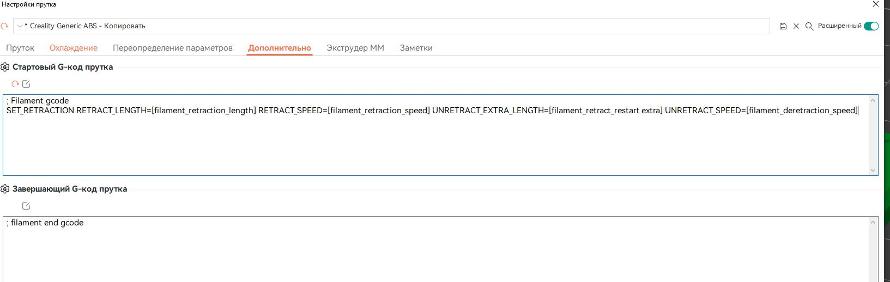
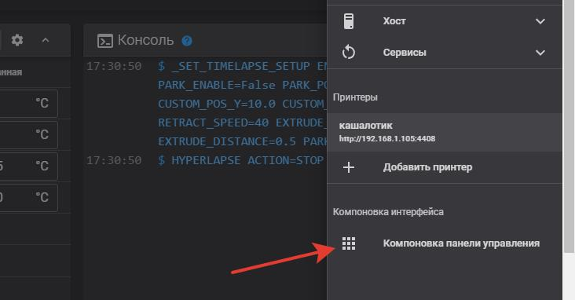
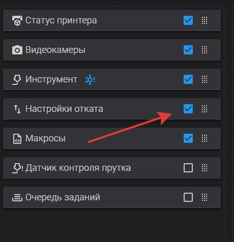
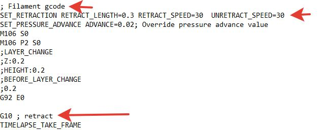

<h2> управляем ретрактом во время печати.</h2>

в прошивке клиппер возможно управлять ретрактом во время печати. это нужно если вы внезапно увидели, что ваш пластик отсырел и начал тянуть сопли,  а у вас уже прошло "n" часов печати и так лень все начинать заново. но для этого нужно немного подготовительной работы. 

первое. в орке заходим в настройки принтера и ставим галки "использовать откат из прошивки" 


далее идем в свойства прутка и явно! указываем цифры отката его скорости извлечения и возврата 

и так для каждого! вида пластика. Иначе работать будет, но значения в начале печати возьмутся из принтер конфига


в "дополнительно" вписываем:

```
SET_RETRACTION RETRACT_LENGTH=[filament_retraction_length] RETRACT_SPEED=[filament_retraction_speed] UNRETRACT_EXTRA_LENGTH=[filament_retract_restart extra] UNRETRACT_SPEED=[filament_deretraction_speed]
```
должно получиться как то так:



если орка ругается на слишком длинную строку в пользовательском коде придется расстаться с одним из параметров например дополнительная длина ретракта. тогда код будет такой:

```
SET_RETRACTION RETRACT_LENGTH=[filament_retraction_length] RETRACT_SPEED=[filament_retraction_speed]  UNRETRACT_SPEED=[filament_deretraction_speed]
```


далее переходим в принтер и открываем файл printer.cfg

вписываем такой раздел:

```
[firmware_retraction]
retract_length: 0.43 # безопасное значение для того пластика которым чаще всего печатаете.
retract_speed: 30
unretract_extra_length: 0
unretract_speed: 30

```
после перезагрузки если вы не увидели нового раздела в правом верхнем углу тыкаем в три точки и ищем следующий раздел:



внутри находим раздел "настройки отката" и ставим галочку



В результате у нас появится новый раздел в веб панели с помощью которого вы можете прямо во время печати управлять вашим ретрактом. 


проверить все ли у вас правильно перед печатью можно нарезав модель и сохранив ее на диск, далее открываем файл с помошью текстового редактора и ищем `; Filament gcode` 



убеждаемся что у нас есть команда **set_retraction** и то что там у нас цифры, а так же что далше у нас есть команды **G10**  которая означает что послана команда на ретракт который будет обработан прошивкой. 