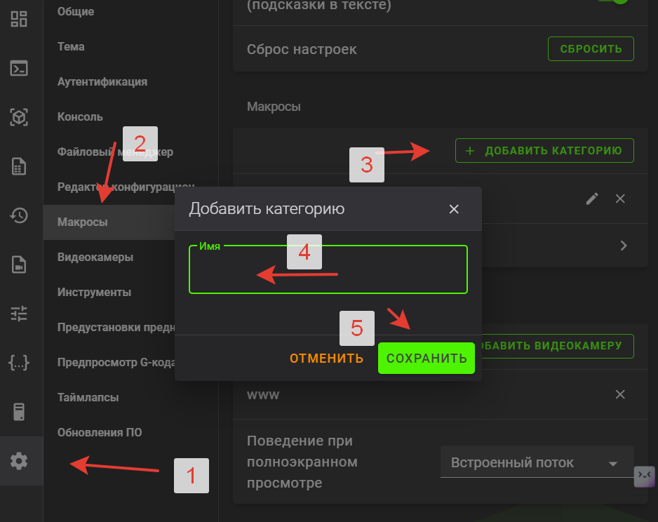
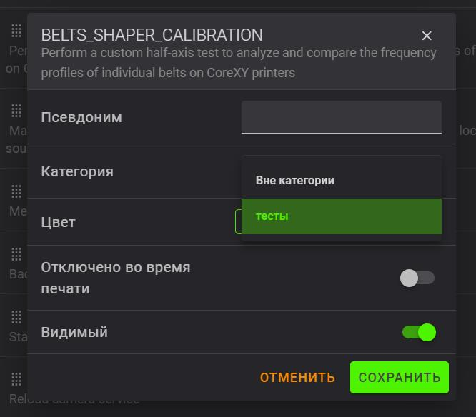
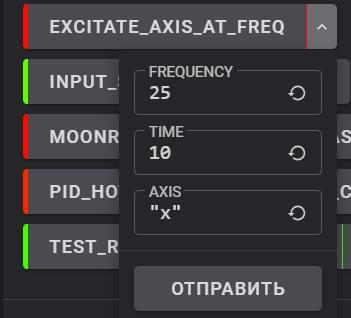
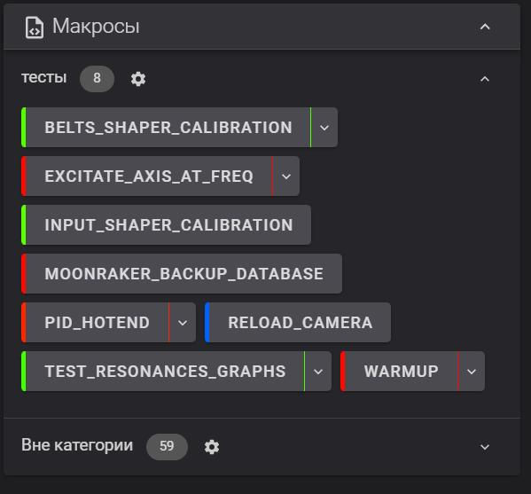

<h5 align="right">поставьте "звездочку" проекту. так другим пользователям легче его найти.</h5>

**список полезных макросов с пояснениями**

После установки хелпер скрипта открывая вашу панель вы можете увидеть огромную "простыню" с всевозможными макросами. В основном они системные и не предполагают никакого взаимодействия с вами. Они от системы для системы и про систему. Чтобы не путаться и не захламлять интерфейс можно провести несколько простых операций:

1 - открываем настройки

2 - нажимаем макросы

3 - добавить категорию

4 - вписываем название категории (у меня это "тесты")

5 - жмем сохранить

Теперь переходим в раздел "вне категории" и по следующему списку выбираем макрос и нажимаем на него и выбираем ему нашу свежесозданную категорию

`BELTS_SHAPER_CALIBRATION` делает тест резонансов и создает график натяжения ремней

`EXCITATE_AXIS_AT_FREQ` макрос тестирования на определенной частоте резонансов для выявления дефектов сборки

На картинке выше мы видим значения по умолчанию. на частоте 25 герц в течении 10 секунд трясем осью икс.  для проведения теста мы ставим 3-5 секунд и перебором частот 25, 27, 30.. и т.д. находим частоту на которой вибрации максимальны. Далее ставим время теста 30-40 секунд и пальпируя корпус находим узел который  вызывает резонанс.  Внешним осмотром выявляем проблему(выкрутился болтик, отклеилась панель, недотянут винт и прочее)  

`INPUT_SHAPER_CALIBRATION` делает тест резонансов и записывает результат в `printer.cfg`

`MOONRAKER_BACKUP_DATABASE` макрос для создания базы данных со статистикой печати (сколько всего потрачено материала, общего времени и прочего). Необходим для сохранения статистики перед обновлением если вам душу греют эти цифры и вы хотите продолжить считать количество времени и пластика потраченного вашим принтером.

`PID_HOTEND` это процедура калибровки, которая гарантирует, что принтер всегда будет поддерживать стабильную заданную температуру . PID (пропорционально-интегральная производная) используется в принтерах для поддержания стабильной температуры в хотенде.

`RELOAD_CAMERA` в принтерах креалити есть проблема с вебкамерами. иногда, при высоких температурах в камере принтера, они могут выключаться от перегрева. Данный макрос поможет перегрузить сервисы камеры без перезагрузки по питанию.

`TEST_RESONANCES_GRAPHS` делает тест резонансов и записывает его в график подробнее [**прочитать тут**](/shaper/readme.md)

`WARMUP` данный макрос двигает печатную голову по осям икс и игрек.  Предназначен для разгона консистентной смазки по валам после процедуры смазки и теста  движений осей икс и игрек.

После этого ваша вебпанель приобретет более аккуратный вид и нужные вам макросы будут более наглядно расположены

