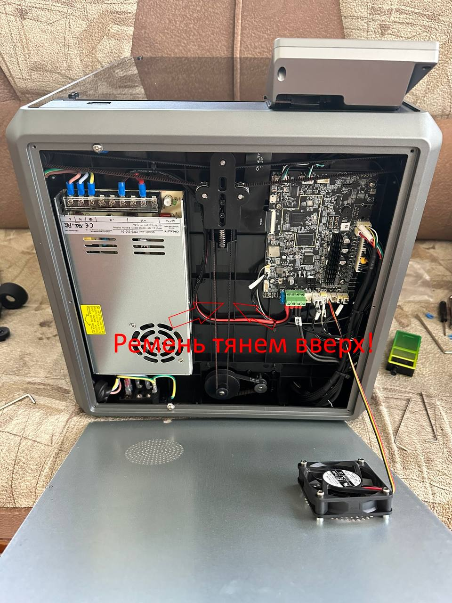

<h3 align="right"><a href="https://www.tinkoff.ru/rm/yakovleva.irina203/51ZSr71845" target="_blank">ваше "спасибо" автору</a></h3>
<h3 align="right"><a href="https://t.me/tombraider2006" target="_blank">телеграм канал автора</a></h3>

**CREALITY K1 FAQ перед первым включением.**

1. Подтянуть болты по кругу.

2. Посмотреть прикручен ли вентилятор 

3. Поднять стол перед включением 
 Achtung! Внимание! 
Обязательно перед включением принтера в розетку, проведите не сложные мероприятия по предотвращению ТЫР-ТЫР-ТЫР столом о низ портала. Так как принтер имеет на борту Klipper, а Klipper имеет особенность опускать стол.

    1) Аккуратно положите на спину принтер.
   
    2) Открутите болты как на скрине.
    
    3) Открыв крышку подвала, не спешите (можно повредить провод куллера).
    
    4) Потяните правую сторону ремня вверх (стол должен туго подниматься вверх).
    
    5) Подняв стол портала примерно до середины, можно собирать в обратной последовательности.
    
Только после данной манипуляции можно включать принтер! 
 
P/S Если в ручную не поднять стол, то после Тыр-Тыр-Тыр у Вас проскочит ремень, а дальше придётся ослаблять его и перекидывать на нужные звенья.

4. Подтянуть пружину прижатия филомента. Если экструдер с светлой прокладкой ничего делать не нужно.

5. Проверить ремни.

6. Промазать хотенд термопастой высокотемпературной например Thermal Grizzly Kryonaut она до 350 градусов .

Вот ссылка на объяснение как 
https://t.me/crealityK1rus/8918
Советы: 

1. Если в prusaslicer добавить эскизы G кода
"32×32, 300×300" формат png, то на экране и в вэбке будут показываться картинки моделей, что удобно.
2. Если есть проблема пропусков шагов то, поджать направляющие в механизме подачи пластика по примеру с видео обзора уголок Технаря.

3. https://youtu.be/CsIAJgCAxFM пример начальной калибровки .
-По калибровке стола сначала опускаем стол в самый низ с экрана, далее выключаем принтер снимаем низ, потом снимаем ремни , опускаем стол руками до конца, закручиваем транспортировочные винты и снова натягиваем ремни , затягиваем натяжитель, выполняем калибровку. 
Готово ✔️ 
Для более точной калибровки:
-Смотрим значения и уже сверху где держится сам стол на винтах откручивает и подкладываем первый слой пластика куда нужно . Я в итоге вывел стол с 0,6, до 0.15. Можно сказать в идеал .

