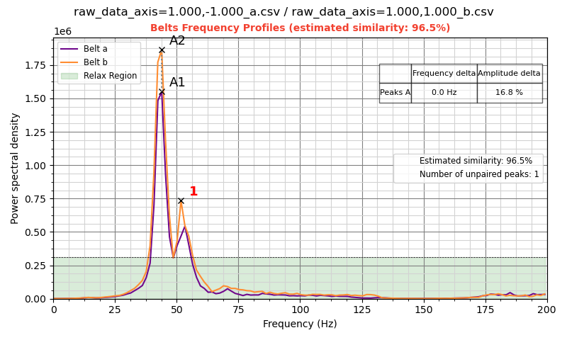
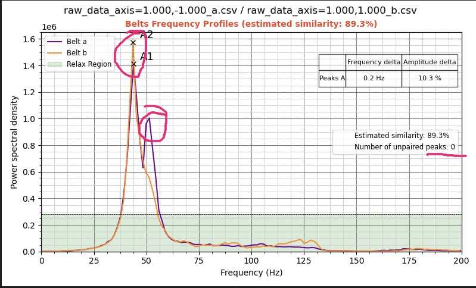
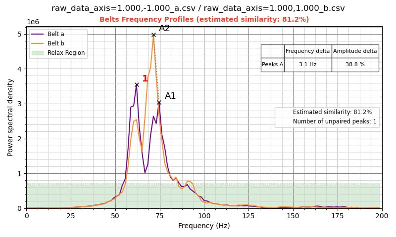
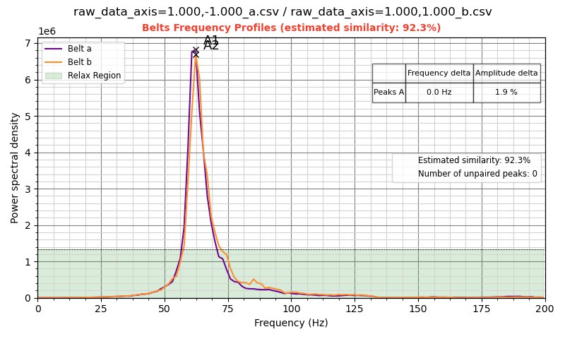
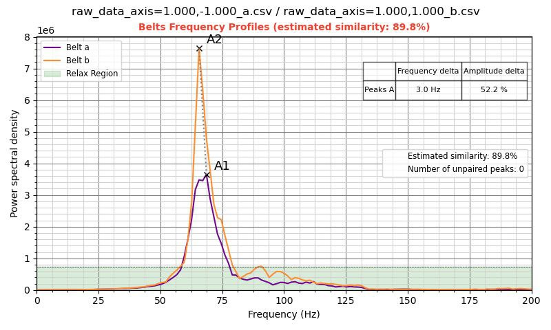
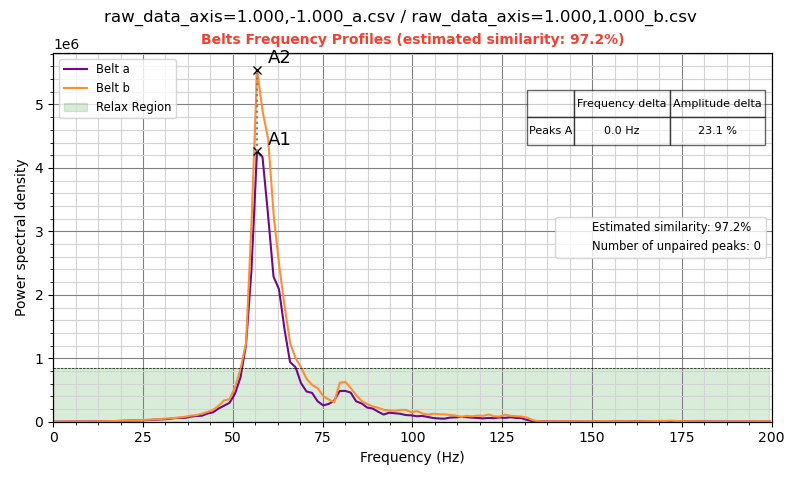
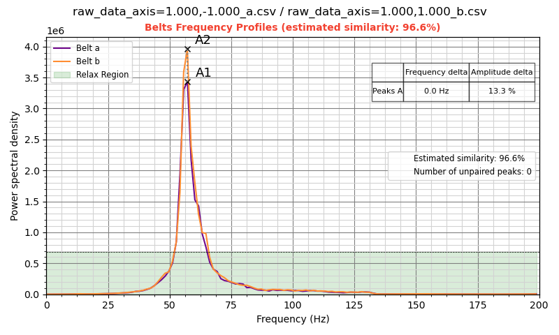

<h2>Регулировка натяжения ремней опираясь на графики</h2>

В составе helper script  у нас есть  инструмент построения графиков belts_shaper_calibration который призван помочь с регулировкой натяжения. Желательно графики ремней рассматривать в совокупности с графиками шейперов.

рассмотрим стандартный график который получают пользователи после первого применения.  

1 непарные пики,  - если там их  есть - вах, все плохо срочно искать где ремень трется. 

2 до 85% жить можно если художка.  если техничка искать какой ремень перетягивает. если 93-97 расслабится и жить спокойно, больше 97  - гордится. 

3 и 4 это расхождение между пиками по амплитуде и частоте, в к1 небольшая разница по амплитуде будет всегда, так что не парится, а вот по частоте это когда вправо влево тянет это уже звоночек о неравномерно натянутых ремнях.

зеленая полоса "Relax_Region", все что в нее попадает не стоит вашего внимания.

рассмотрим более клиничиские случаи.

<h3>дополнительный пик</h3>

однако может быть и вот так:

что является просто сбоем алгоритма, сути не меняет и лечится точно также, поиском ошибок кинематики, трений ремня, задеваний, перекосов.

Также подтверждение мы можем увидеть и на графике шейперов вот 2 графика:

а вот график от этого же принтера только шейперов по игрек:

низкая амплитуда нам говорит о слабом натяжении ремня, но увидев в графике шейперов размерность 1е4 мы можем предположить что с натяжкой тут все в порядке но есть явное задевание в одном месте.  такой дефект может быть изза ослабления  крепления шкива на моторе к примеру.

<h3>Заклинивание осей</h3>

на графике в таком случае мы можем увидеть примерно такое:

или даже так:

 в данном случае можно предположить заклинивание сразу по двум осям,  однако вероятнее всего что изза перенатяжения одного из ремней каретка оси стоит наискосок к порталу что вызывает дергания при тесте второго ремня,  основанием для такого предположения является слишком большая разница в амплитудах наших графиков. тоесть разбираться нам надо с осью игрек и смотреть как ходят ремни и правильно ли установлен шкив мотора.  самый вероятный вариант - перекос зубчатого шкива.

<h3>Расхождения по частоте</h3>

На самом деле найти большие расхождения по частоте в графиках пользователей мне не удалось.  в основном они колеблются в районе 1.5-3 герца. 

или так: 

Это лечится проверкой паралельности портала. как это сделать описано ниже в части расхождение по амплитуде.

<h3>Расхождения по амплитуде</h3>

несколько примеров:

самый частый вариант который можем встретить в графиках по ремням.

Для проверки правильного расположения каретки икс можно использовать очень простой способ.  

Выводим нашу голову на середину портала с выключенными моторами.  подпихивая ее пальцем к переднему краю до упора.

Внимательно смотрим какой край приехал первый и можем проверить нажав с усилием на каждом из концов портала. 

Вероятнее всего что с одной из сторон будет приезжать неодновременно.  Эта разница потом будет влиять на геометрию наших деталей так что задача с помощью регулировки натяжения ремней сократить это расстояние до минимального вплоть до полного отсутсвия зазора. 

вполне вероятно что график при хорошей регулировке будет выглядеть как то так

или так:

небольшая разница по амплитуде в данном случае не страшна и не говорит о плохой регулировке.

стоит также обратить внимание на размерность. если у вас получилось так: 

размерность 1е7 говорит о том что ремни натянуты недостаточно хотя и относительно правильно. 