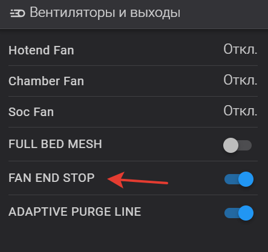
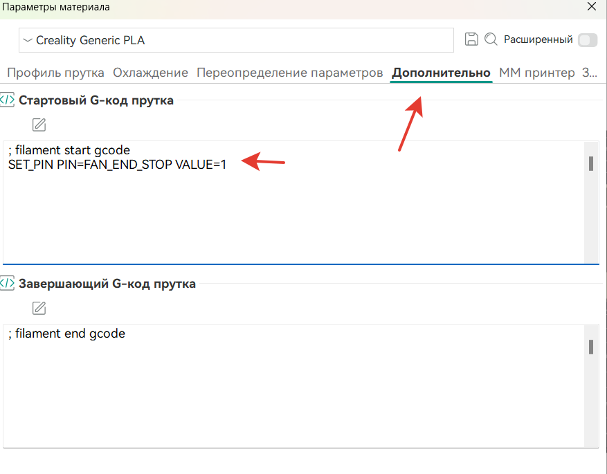

<h2>Добавление функционала на основе virtual_pins на примере отключения вентиляторов в конце печати.</h2>

Тут попросили меня реализовать не очень полезную идею по отключению вентиляторов в конце печати, ну так то идея так себе, но *раз звезды зажигают - значит это кому то нужно.* 

Итак идея. необходимо дать команду в слайсере для определенного пластика чтобы при окончании печати он не включал обдув а просто заканчивал печать. 

сам макрос END_PRINT выглядит так:

```
[gcode_macro END_PRINT]
gcode:
  Qmode_exit
  EXCLUDE_OBJECT_RESET
  PRINT_PREPARE_CLEAR
  M220 S100
  SET_VELOCITY_LIMIT ACCEL=5000 ACCEL_TO_DECEL=2500
  TURN_OFF_HEATERS
  M107 P1
  M107 P2
  END_PRINT_POINT
  WAIT_TEMP_START
  M84
```
часть отвечающая за старт работы кулеров это `WAIT_TEMP_START` Необходимо обрамить ее условиями и для этого применим модуль virtual_pins (если у вас по каким то причинам нет этого модуля это легко исправить - достаточно в /klippy/extras/ добавить [virtuals_pins.py](virtual_pins.py) и добавить в `printer.cfg` раздел  `[virtual_pins]` )

Начнем с того что в printer.cfg добавим саму кнопку. Важно! код необходимо вставить после раздела `[virtual_pins]`

```
[output_pin FAN_END_STOP]
pin: virtual_pin:FAN_END_STOP_pin
value: 0
```

фантазии у меня нет, так что название выдумал такое, какое пришло в голову.

сохраняем перегружаем смотрим. Должно получится как то так:



по умолчанию он у нас будет выключен. 

теперь идем в gcode_macro.cfg находим END_PRINT и обрамляем макрос WAIT_START условиями

```
[gcode_macro END_PRINT]
gcode:
  Qmode_exit
  EXCLUDE_OBJECT_RESET
  PRINT_PREPARE_CLEAR
  M220 S100
  SET_VELOCITY_LIMIT ACCEL=5000 ACCEL_TO_DECEL=2500
  TURN_OFF_HEATERS
  M107 P1
  M107 P2
  END_PRINT_POINT
  
   WAIT_TEMP_START
   SET_PIN PIN=FAN_END_STOP VALUE=0
  
  M84
  
```

По умолчанию мы назначили значение нашей кнопки 0 и проверив условия когда у нас значение равно 0 принтер продолжит выполнение макроса и выполнит  WAIT_START но если мы переведем нашу кнопку в значение 1 мы эту строку перепрыгнем. Чтобы после печати кнопка наша вернулась в исходное состояние в конце дописываем значения кнопки 0.

Теперь если мы включим нашу виртуальную кнопку в конце печати кулер головы не будет дуть на наш хотенд.  но хотелось бы это внести в слайсер. Да легко! В орке открываем профиль нужного пластика и лезем на вкладку дополнительно и вписываем переключение нашей кнопки. кстати синтаксис ее нажатия можно всегда подсмотреть в консоли клиппера.

вписываем 

```
SET_PIN PIN=FAN_END_STOP VALUE=1
```

получится как то так:



всё. готово. 
