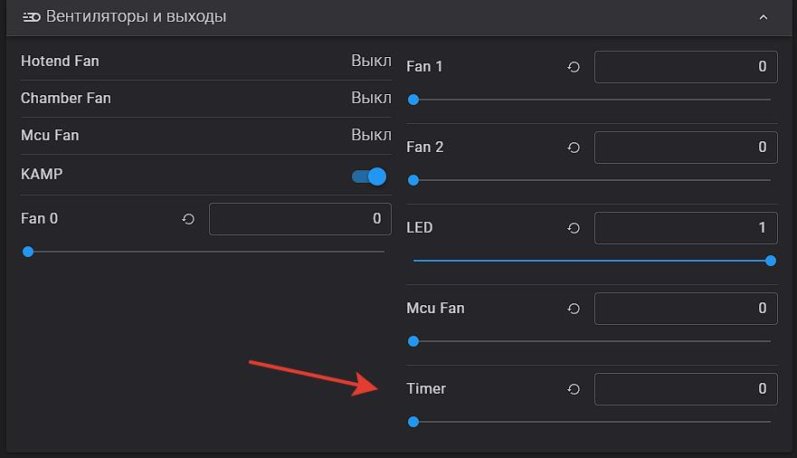
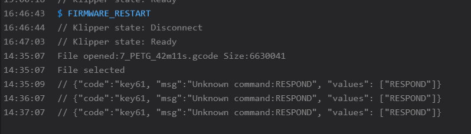

<h3 align="right"><a href="https://pay.cloudtips.ru/p/f84bf0b2" target="_blank">ваше "спасибо" автору</a></h3>
<h1>таймер отложенной печати</h1>


предположим время вечер, просыпаться поутру лень, некогда, или, например, хочу чтоб принтер начал печатать в три ночи чтоб к утру  заменить филамент и к обеду распечатать, так вот, нет у него такой функции чтоб по будильнику печатать. можно конечно через HOME ASSITANT и прочие умные домики, но это вроде как не спортивно...

**Внимание! так как в новых версиях Хелпер скрипта уже этот модуль есть то пункт 1 пропускаем**

итак приступаем:
 
 **1.** заходим по ssh на принтер и вписываем (если ставили хелпер скрипт и пункт 6 в нем то это можно пропустить, я уже инициировал добавку виртуал пинов в хелпер скрипте)

```
cd /usr/share/klipper/klippy/extras
wget --no-check-certificate https://raw.githubusercontent.com/Tombraider2006/K1/main/random/virtual_pins.py

```

 **2.** далее открываем  `printer.cfg`  например через вебпанель и вписываем в любое свободное место: 

```
[virtual_pins] # если хелпер скрипт установлен то эту строку стоит закоментировать
[output_pin timer]
pin: virtual_pin:timer_pin
pwm: True
value: 0
scale: 1440


[delayed_gcode wait_timer] 
 # initial_duration: 2.
gcode:
    
    
    
    
    
    
      RESPOND MSG="Waiting... {WAIT_ROUNDED} minutes remaining."
      
      SET_PIN PIN=timer VALUE={WAIT_ROUND_COUNT}
      UPDATE_DELAYED_GCODE ID=wait_timer DURATION=60
      WAIT_TIMER_START
    
     RESPOND MSG="Wait Time End"
     WAIT_TIMER_END	
    
 

[gcode_macro WAIT_TIMER_START]
gcode:
  UPDATE_DELAYED_GCODE ID=wait_timer DURATION=1
  
  SET_PIN PIN=LED VALUE=0.25
  G4 P14000
  SET_PIN PIN=LED VALUE=0.5
  G4 P1000
  

[gcode_macro WAIT_TIMER_END]
gcode:
  UPDATE_DELAYED_GCODE ID=wait_timer DURATION=0
  SET_PIN PIN=LED VALUE=1

```
сохраняем без перезагрузки

**3.**  в папке /Helper-Script/KAMP ищем файл `Start_Print.cfg`
   и сразу после строки `gcode:` нажимаем Enter и вписываем:
```
WAIT_TIMER_START
```

получится как то так как то так:


сохраняем, перегружаемся. 

4. теперь в интерфейсе появился новый элемент:



Теперь если перед печатью ввести в окошко значения количество минут (вплоть до 1440 что равно 24 часам) то печать стартует только после этого времени.  все это время принтер будет иногда вам помаргивать светом подсветки раз в 14 секунд.  
если вы передвинете ползунок на новое значение в течении минуты обновится значение таймера, если скинуть на ноль то печать начнется как только пройдет минута или меньше. 

если при запуске появилась вот такая ошибка


в файле `printer.cfg` добавьте в любом месте раздел 
```
[respond]
```

 

P.P.S если вы не можете отредактировать файл /Helper-Script/KAMP/Start_Print.cfg это от того что это у вас не папка а ссылка на папку.   вы можете отредактировать /usr/data/KAMP-for-K1-Series/Configuration/Start_Print.cfg или всю папку переписать в /usr/data/printer_data/config/Helper-Script/KAMP удалив ссылку на папку. 

[**thank a lot for assistance in writing the macro -  Guilouz**](https://github.com/Guilouz)

<h5 align="right">поставьте "звездочку" проекту. так другим пользователям легче его найти.</h5>