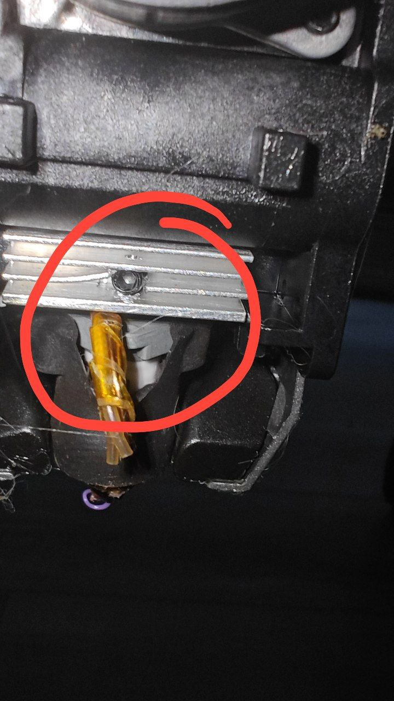

<h3 align="right"><a href="https://www.tinkoff.ru/rm/yakovleva.irina203/51ZSr71845" target="_blank">ваше "спасибо" автору</a></h3>

[**Обучение в режиме онлайн консультации**](kurs.md)

[**дополнительные материалы к лекциям**](/extras/readme.md)

[**CREALITY K1 FAQ перед первым включением.**](before_use.md)

[**Родные коды ошибок креалити**](https://store.creality.com/blog/creality-k1-fault-codes-list) по мне бесполезная шляпа, гораздо правильнее читать сообщения от клиппера в вебпанели. но если очень хочется можно и почитать. 

[**Что купить чтобы принтер вас любил**](/what_2_buy/readme.md)

[**Актуальная версия прошивки с инструкциями по установке**](/version_config/readme.md)

[**Полезные макросы**](/macros_helpfull/readme.md)

[**Управляем ретрактом во время печати**](/retract/readme.md)

[**Читаем графики шейперов**](/shaper/readme.md)

[**Еще несколько советов по принтеру**](/ferma/readme.md)

Далее  пункты "ОчУмелые Ручки"

[**Подключение Raspberry Pico для расширения количества pin для ваших самоделок и дополнений**](/usb/readme.md)

[**если очень хочется сделать из принтера новогоднюю ёлку. руководство по установке WLED**](https://github.com/Gliptopolis/WLED_Klipper)

[**выбор самурая - переход на клиппер без креалити**](https://github.com/pellcorp/creality/wiki/K1-Stock-Mainboard-Less-Creality)

[**таймер отложенной печати**](timer.md)

**как быстро определить какое сопло(unicorn\volcano) на вашем принтере**

если видно отверстие на радиаторе хотенда и болтик под шестигранник значит у вас vulcano, если радиатор без отверстий значит unicorn.

[**Ветка бутлоадера от CREALITY**](https://github.com/CrealityOfficial/K1_Series_Annex/releases/tag/V1.0.0)

