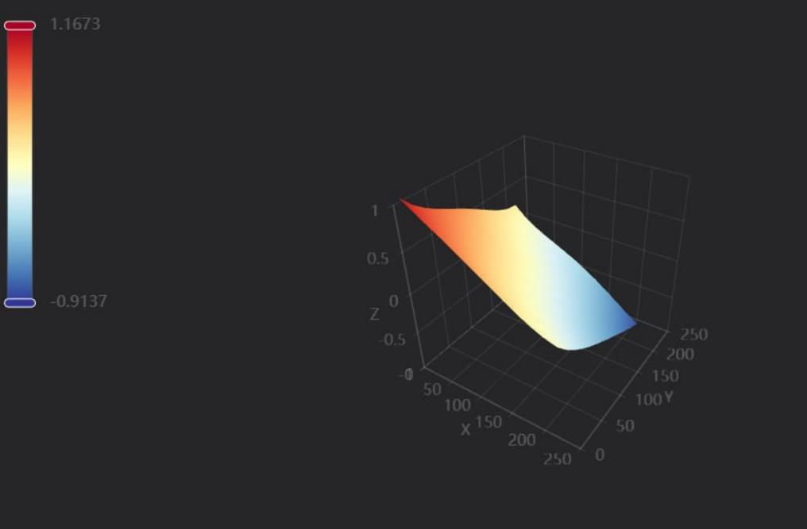
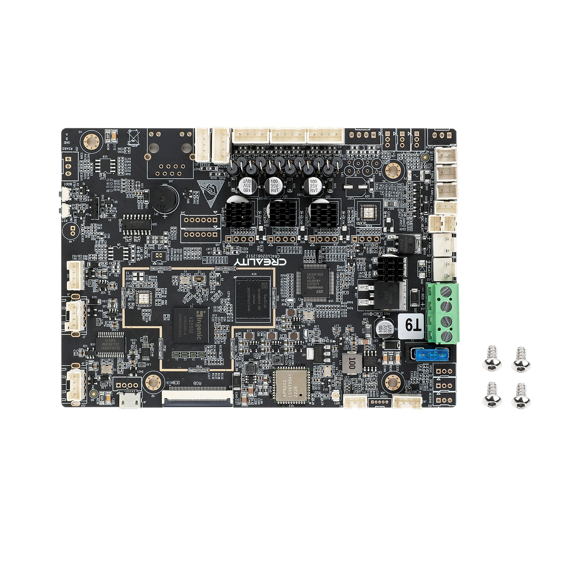

**CREALITY K1 FAQ перед первым включением.**

1. Подтянуть болты по кругу под 

2. Посмотреть прикручен ли вентилятор 

3. Поднять стол перед включением 

4. Подтянуть пружину прижатия филомента. Если экструдер с светлой прокладкой ничего делать не нужно.

5. Проверить ремни.

6. Промазать хотенд термопастой высокотемпературной например Thermal Grizzly Kryonaut она до 350 градусов .

Вот ссылка на объяснение как 
https://t.me/crealityK1rus/8918
Советы: 

1. Если в prusaslicer добавить эскизы G кода
"32×32, 300×300" формат png, то на экране и в вэбке будут показываться картинки моделей, что удобно.
2. Если есть проблема пропусков шагов то, поджать направляющие в механизме подачи пластика по примеру с видео обзора уголок Технаря.

3. https://youtu.be/CsIAJgCAxFM пример начальной калибровки .
-По калибровке стола сначала опускаем стол в самый низ с экрана, далее выключаем принтер снимаем низ, потом снимаем ремни , опускаем стол руками до конца, закручиваем транспортировочные винты и снова натягиваем ремни , затягиваем натяжитель, выполняем калибровку. 
Готово ✔️ 
Для более точной калибровки:
-Смотрим значения и уже сверху где держится сам стол на винтах откручивает и подкладываем первый слой пластика куда нужно . Я в итоге вывел стол с 0,6, до 0.15. Можно сказать в идеал .


**‼️Гайд о подключении K1 и Fuidd‼️(30.06)**


1.Скачать WinSCP и установить |https://winscp.net/eng/download.php|

2.Узнать адрес вашего K1 (через настройки вашего роутера, или на экране принтера (настройки(шестеренка)->Network))

3.Узнать версию прошивки K1 (1.2.9.15 - перейти на пункт 11, 1.2.9.21 продолжить с 4 пункта)

4.Скачать файл для понижения прошивки до 1.2.9.15  CR4CU220812S11_ota_img_V1.2.9.22.img

5.Загрузить файл на флешку (форматировать флешку fat32, 4096 байт)

6.Включить K1❗️

7.Вставить флешку❗️

8.В всплывающем окне подтвердить обновление

9.Убедиться что прошивка 1.2.9.15

10. Сбросить К1 до заводских настроек

11.Запустить WinSCP (ПК и K1 должны находиться в одной сети)

12. Ввести сетевой адрес K1

 логин ```root```
 пароль ```0755cxsw$888```

 подключиться

13. В файле `/etc/init.d/S50nginx` убираете комментарии со строчек: 

```
#       mkdir -p /var/log/nginx /var/tmp/nginx
#       start-stop-daemon -S -x "$NGINX" -p "$PIDFILE"
```

14. В файле `/etc/init.d/S56moonraker_service` убираете комментарий со строчки:

`#        start`

15. Перезагружаете принтер

16. По 'сетевому адресу' K1 останется стандартный интерфейс от криалити, а по 'сетевому адресу' :4408 ( пример 192.168.1.1:4408) будет интерфейс Fuidd.

**Если видим такую картину при тесте стола**



Залезть в подвал, скинуть ремень, выставить стол в горизонт относительно портала и накинуть ремень обратно

Ссылка на материнскую плату принтера: https://aliexpress.ru/item/1005005666116140.html


**Фото платы принтера**



