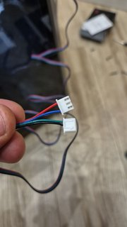
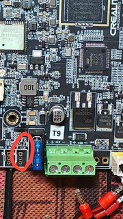
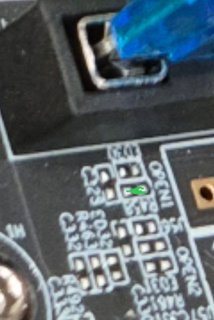
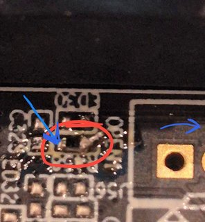
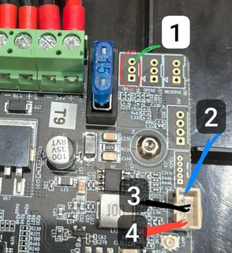
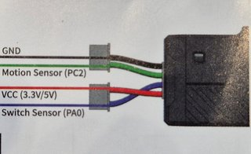
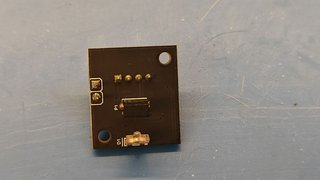
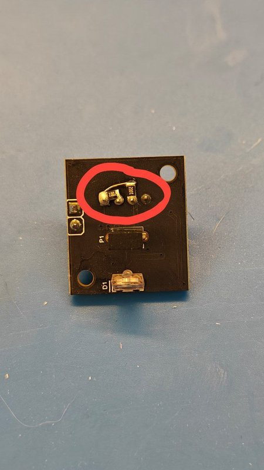
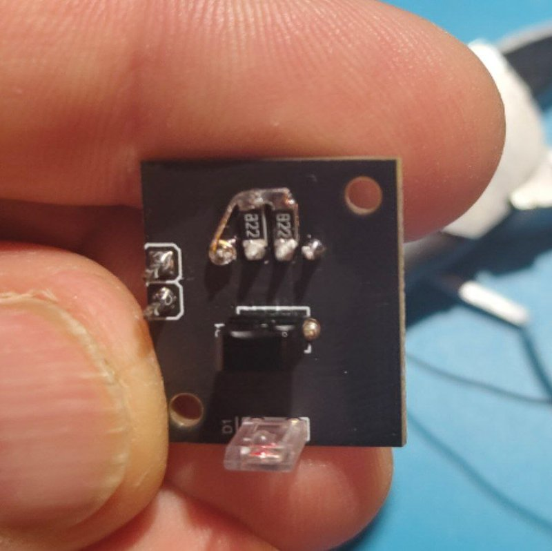

<h3 align="right"><a href="https://www.tinkoff.ru/rm/yakovleva.irina203/51ZSr71845" target="_blank">ваше "спасибо" автору</a></h3>
<h3 align="right"><a href="https://t.me/tombraider2006" target="_blank">телеграм канал автора</a></h3>
<h5 align="right">поставьте "звездочку" проекту. так другим пользователям легче его найти.</h5>

При печати на 3D принтере решил обезопасить себя не только паузой при окончании филамента, но также в случае перехлеста или другой причине остановки подачи пластика в экструдер  

Дляя этого был приобретен  датчик филамента ВТТ sfs v2.0


Решил припаяться к материнской плате. 

Так как короб с проводами вскрывать не хотелось, то отрезал контакты от купленного датчика с одной стороны (где их 2) просунул между проводами родного датчика и вытянул провода от родного датчика филамента, заодно протянув провода для нового. 



*Вот это отрезал*

Далее берем SMD резистор 0402 на 100 ом (можно 0805)

Припаиваем резистор  сюда:





*На этой фотографии видно лучше.*

Чтобы проверить правильность пайки - берем тестер и замеряем сопротивление - должно быть 100 Ом



Один щуп сюда, второй на дальнее отверстие разъема
Далее берем 3-пиновый разъём PH2.0 (можно и XH2.54 , но придется чуть подогнуть ножки)



Соединение делаем так - цвета линий соответствуют цвету проводов от датчика.



Из инструкции
Для принтера на klipper и/или стоковой прошивке  вносим правки в `printer.cfg`

Надо закомментировать/удалить код, который прописан был для родного датчика и вписать следующий код:

```
[filament_switch_sensor filament_sensor]
switch_pin: ^PC15
pause_on_runout: False
runout_gcode:
 PAUSE # [pause_resume] is required in printer.cfg
 M117 filament_switch_runout
insert_gcode:
 M117 Filament switch inserted


[filament_motion_sensor encoder_sensor]
switch_pin: ^PA7
detection_length: 5.3
extruder: extruder
pause_on_runout: False
runout_gcode:
 PAUSE # [pause_resume] is required in printer.cfg
 M117 filament_encoder_runout
insert_gcode:
 M117 Filament encoder inserted

 ```
Перезагрузить прошивку и всё должно работать.

Можно поменять синий и зеленый провода местами, при этом не забудьте поменять пины в вышеуказанном коде. 

P.S. Про длину (detection_length) 

Параметр `detection_length: 5.3` 

отвечает за длину в мм за которое должен поступить сигнал от энкодера, если этого не происходит, то датчик дает сигнал о том, что нить перестала двигаться.

Производитель рекомендует поставить 2.88, но по факту подбора у меня перестали быть ложные срабатывания только на 5.3


P.S.S. **Про подтяжки**

В процессе тестирования выяснилось, что нужна подтяжка обоих сигнальных пинов к питанию. Есть 2 варианта - в конфиге перед именем пина дописать "^" (сейчас в коде выше так и указано), либо напаять внутрь SFS (место там есть) физические подтяжки из резисторов 10кОм. По совету сообщества пошел по второму пути, но будет работать и первый способ.

Для способа с резисторами в коде должно быть так:
```
[filament_switch_sensor filament_sensor]
switch_pin: PC15
```

```
[filament_motion_sensor encoder_sensor]
switch_pin: PA7
```


Вид датчика с лицевой стороны



С обратной стороны (еще без резисторов)



результат



Можно и так

спасибо за мануал https://t.me/prokudinvn