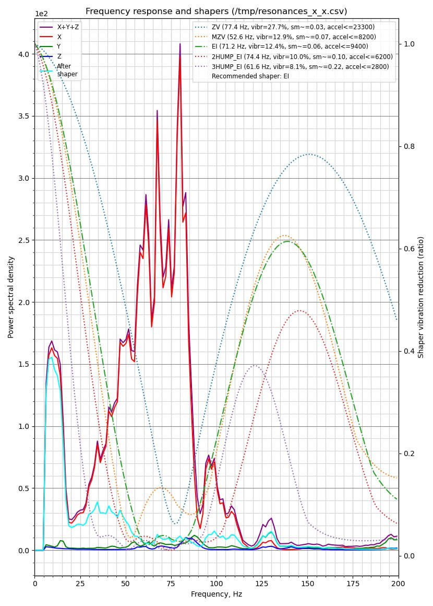
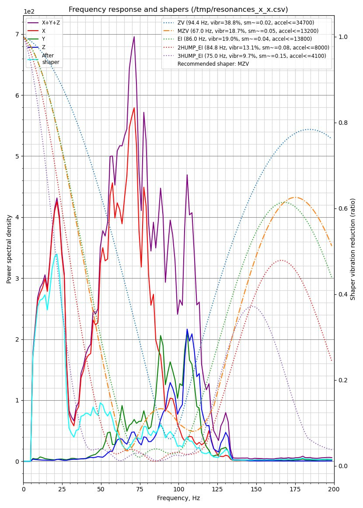
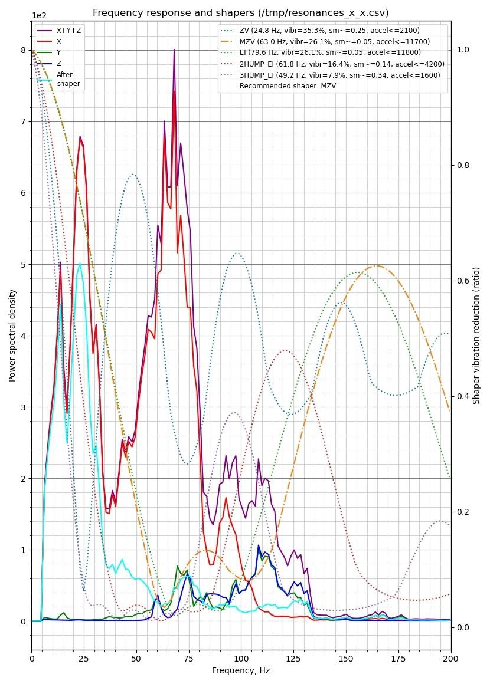
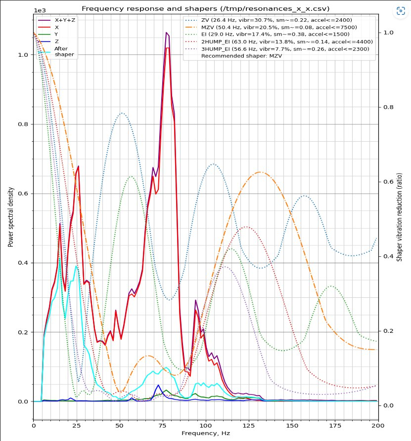
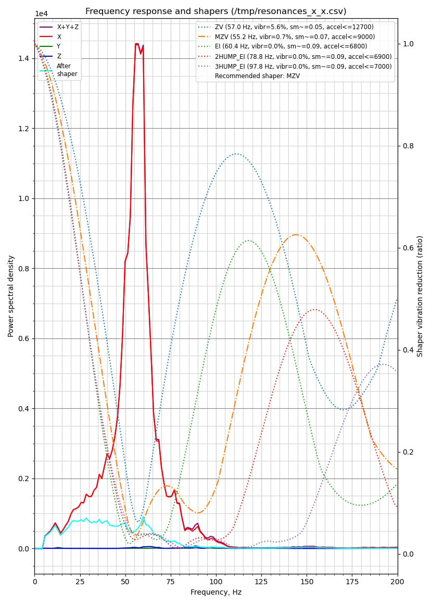
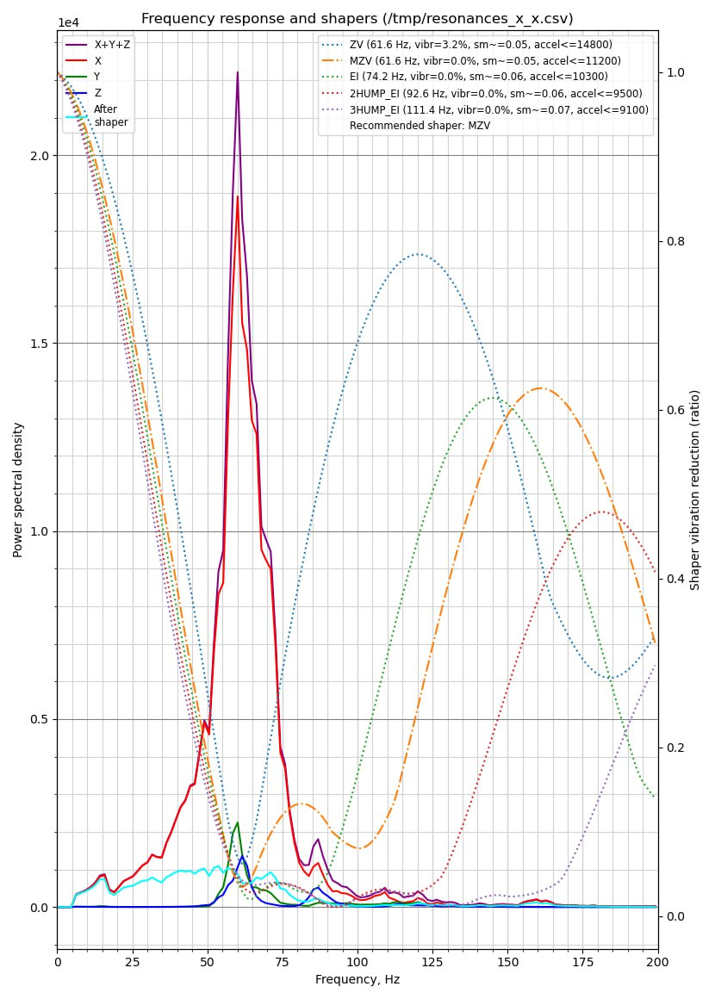
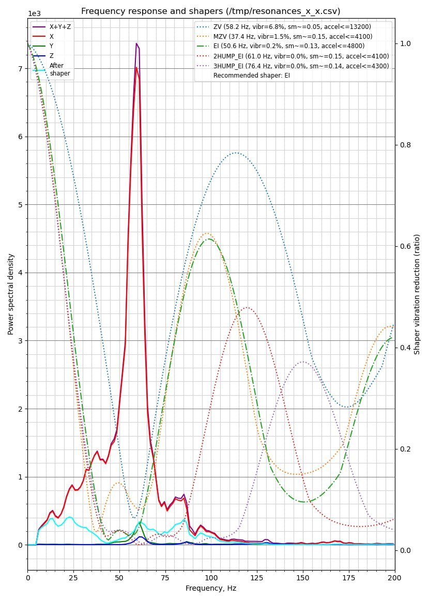

**читаем графики шейперов**

основная статья по шейперам у меня как и раньше [расположена тут](https://github.com/Tombraider2006/klipperFB6/tree/main/accel_graph).

 Данный материал предназначен для тех, кто решает надо ли  производить расточку посадочных мест под втулки печатной головы или ему повезло.  максимально упрощенно и максимально наглядно покажу что и как делать. 

 для того чтобы произвести тест необходимо поставить [**Helper script**](https://guilouz.github.io/Creality-Helper-Script-Wiki/helper-script/helper-script-installation/) если он уже у вас установлен находим макрос `TEST_RESONANCES_GRAPHS` запускаем и дожидаемся выполнения. 
 
 После окончания теста в папке:
 
  `/Helper-Script/improved-shapers`

будут находится наши графики,  нас интересуает тот, что отображает данные по икс.   как могут выглядеть плохие графики: 

Обратите внимание на голубую линию которая обозначает кривую резонансов *после*  применения шейперов на всех вышеперечисленных графиках мы видим ярко выраженный пик в районе 12-17 герц.  это означает что вам необходимо провести работы со втулками оси икс в [**чатике**](https://t.me/crealityK1rus) ищется по поиску "Как вылечить клин Х" 

как выглядит график у тех кто провел операцию по устранению и у тех, кому повезло купить принтер без косяков и не игнорировать смазку осей.

 P.S. 
  в данном руководстве не рассматриваются конкретные значения ускорений. графики рассматриваются исключительно по кривым резонансов и служат для демонстрации возможных проблем и их решений. 