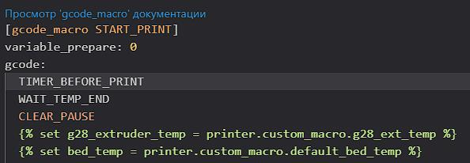

<h1>таймер отложенной печати</h1>


предположим время вечер, просыпаться поутру лень, некогда, или, например, хочу чтоб принтер начал печатать в три ночи чтоб к утру  заменить филамент и к обеду распечатать, так вот, нет у него такой функции чтоб по будильнику печатать. можно конечно через HOME ASSITANT и прочие умные домики, но это вроде как не спортивно...

итак приступаем:
 
 **1.** заходим по ssh на принтер и вписываем 

```
cd /usr/share/klipper/klippy/extras
wget --no-check-certificate https://raw.githubusercontent.com/Tombraider2006/K1/main/virtual_pins.py

```

 **2.** далее открываем  `printer.cfg`  например через вебпанель и вписываем в любое свободное место: 

```
[virtual_pins]
[output_pin timer]
pin: virtual_pin:timer_pin
pwm: True
value: 0
scale: 1440
shutdown_value: 0

[gcode_macro TIMER_BEFORE_PRINT]
description: delayed printing in minutes
gcode:
  
    
    
    
      
    
    RESPOND MSG="Waiting... {WAIT_ROUNDED} minutes remaining."
        
          RESPOND MSG="Waiting... {WAIT_ROUNDED-i} minutes remaining."
          
            SET_PIN PIN=LED VALUE=0.25
            G4 P14000
            SET_PIN PIN=LED VALUE=0.5
            G4 P1000
        
    
    SET_PIN PIN=LED VALUE=1
  
    RESPOND MSG="Wait Time not enabled!"
  

```
сохраняем без перезагрузки

**3.**  в папке /Helper-Script/KAMP ищем файл `Start_Print.cfg`
   и сразу после строки `gcode:` нажимаем Enter и вписываем:
```
TIMER_BEFORE_PRINT
```

получится как то так как то так:




сохраняем, перегружаемся. 

4. теперь в интерфейсе появился новый элемент:


Теперь если перед печатью ввести в окошко значения количество минут (вплоть до 1440 что равно 24 часам) то печать стартует только после этого времени.  все это время принтер будет иногда вам помаргивать светом подсветки раз в 14 секунд.  

если при запуске появилась вот такая ошибка


в файле `printer.cfg` добавьте в любом месте раздел 
```
[respond]
```

P.S. на данный момент отменить таймер только жестким ребутом прошивки, не клиппера, так как макрос продолжает работу и последуеще дергание таймера не приводит к изменению времени. работаю над этим. 

P.P.S если вы не можете отредактировать файл /Helper-Script/KAMP/Start_Print.cfg njтэто от того что это у вас не папка а ссылка на папку.   вы можете отредактировать /usr/data/KAMP-for-K1-Series/Configuration/Start_Print.cfg или всю папку переписать в /usr/data/printer_data/config/Helper-Script/KAMP удалив ссылку на папку. 