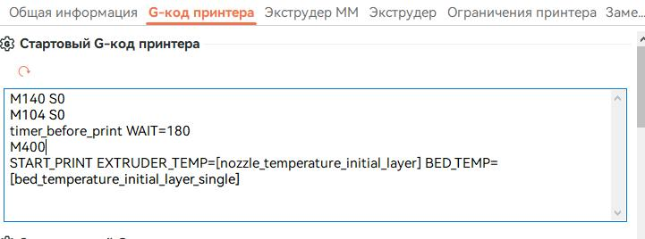

я вот сижу удивляюсь. 2024 год.. а оказывается переменную времени в клиппере взять неоткуда..


это я к чему, предположим время вечер, просыпаться поутру лень, некогда, или, например, хочу чтоб принтер начал печатать в три ночи чтоб к утру  заменить филамент и к обеду распечатать, так вот, нет у него такой функции чтоб по будильнику печатать. можно конечно через HOME ASSITANT и прочие умные домики, но это вроде как не спортивно...

в общем буду смотреть что получится.. ну если кто умный есть то вот вам с чего я начинаю.

1. 

```
[gcode_macro timer_before_print]
description: delayed printing in minutes
gcode:
    
    
        RESPOND MSG="Waiting... {WAIT-i} minutes remaining."
        
            SET_PIN PIN=LED VALUE=0.25
            G4 P500
            SET_PIN PIN=LED VALUE=0.5
            G4 P500
        
    
    SET_PIN PIN=LED VALUE=1
```

моргать от четверти светимости до половины светодиодом чтоб было понятно что не просто так стоит..  ничего умнее мне в голову не пришло..

если вам не надо моргать так часто то можно сделать так:

```
[gcode_macro timer_before_print]
description: delayed printing in minutes
gcode:
    
    
        RESPOND MSG="Waiting... {WAIT-i} minutes remaining."
        
            SET_PIN PIN=LED VALUE=0.25
            G4 P14000
            SET_PIN PIN=LED VALUE=0.5
            G4 P1000
        
    
    SET_PIN PIN=LED VALUE=1
```

 так 14 секунд 0.25 светимости, потом 1 секунду 0.5 светимости..

 ну или третий вариант если вам не нужны спецэффекты 

 ```
 [gcode_macro timer_before_print]
description: delayed printing in minutes
gcode:
    
    
        RESPOND MSG="Waiting... {WAIT-i} minutes remaining."
        
            G4 P1000
        
    
```

выбираем один из моих  вариантов  который вам больше нравится или делаем свой и  вписываем в файл `gcode_macro.cfg`

2. в слайсере в настройках принтера ищем стартовый g-code и исправляем примерно так :



```
timer_before_print WAIT=180
M400 
```
180 в данном случае это 180 минут, тоесть принтер задумается на три часа перед печатью. 


если при запуске появилась вот такая ошибка


в файле `printer.cfg` добавьте в любом месте раздел 
```
[respond]
```