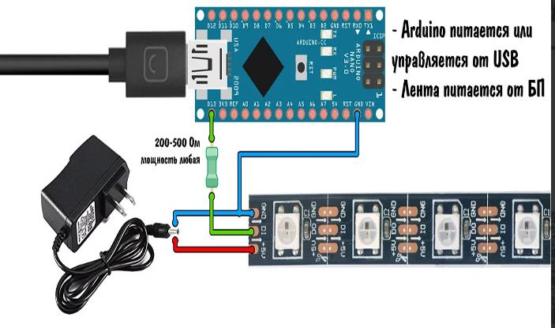

<h3 align="right"><a href="https://www.tinkoff.ru/rm/yakovleva.irina203/51ZSr71845" target="_blank">ваше "спасибо" автору</a></h3>

**Подключение raspbery pico к принтеру**

Основным препятствием в ваших самоделках может быть отсутствие свободных пинов на материнской плате принтера, данный мануал даст вам возможность добавить их некоторое количество с помощью подключения дополнительного mcu основанного на Raspbery pico. что даст возможность подключить множество различных устройств. 

Дополнительным плюсом данного решения является то что в случае форсмажора, в 90% случаев, сгорит плата за 500р которая не влияет на процесс печати. если искать пин на плате принтера - в случае форсмажора и  неисправности материнской платы траты в виде 5000р и простой принтера на время доставки платы.

**1.** Вскрываем днище нашего корпуса принтера.


**2.** Находим свободный юсб разъем на плате. *Свободный он у пользователей к1\к1с но и пользователям к1макс обычно он не нужен так как задействован под лидар который все  снимают*


**3.** Обжимаем разьем из любого подходящего микро юсб кабеля. Разъёмы на плате принтера для всех USB подключений - JST PH 2.0 mm 4pin (PH2.0 4P) *Тут сделаю небольшую ремарку, вывести кабель я предлагаю на заднюю стенку принтера, благо там есть и кабель каналы и отверстия подходящие,  Можно вывести не просто разьем microUSB а полноценный хаб на 2-4 разьема, его и проверить легче - определилась вставленная флешка - значит все соединено правильно.* Рекомендуемый [встраиваемый хаб для такого мода](https://aliexpress.ru/item/1005005887148469.html)


**4.** Теперь нам нужно прошить нашу pico. На самом принтере "К1" серии это сделать проблематично поэтому есть несколько вариантов поставить klipper на другую подходящую железку

```
cd ~/klipper
make clean
make menuconfig
```

   в меню выбрать:


потом:

```
make
```

Переходим в каталог, в который скомпилировалась прошивка cd ~/klipper/out и смотрим там листинг файлов ls -la. Там должен быть файл с именем `klipper.uf2`


ну или не мучаться и скачать готовую прошивку [**тут**](klipper.zip) не забудьте распаковать файл. 

*чужой конфиг\прошивка - как чужие трусы. подойти может но послевкусие неприятное*

**5.** Прошиваем:

 UF2 режим можно активировать удерживанием кнопки BOOTSEL при подачи питания по USB. Появится накопитель «RPI-RP2», который можно использовать для копирования бинарных файлов uf2.

**6.** Подключаем к разьему.

Зайдя на наш принтер по ssh выполняем:

```
ls /dev/serial/by-path/* 
```
(также можно использовать /dev/serial/by-id/)

```
ls /dev/serial/by-id/*
```

должны увидеть что-то типа такого:

```
 /dev/serial/by-id/usb-Klipper_rp2040_E660B4404B3EAB35-if00
```

если не увидели то возможные варианты:

 - плохой кабель
 
 - неправильно сделан разьем.

**6.1** Предлагаю сразу распечатать корпус для нашей MCU чтобы не выглядело лютым колхозом.  [**модель тут**](https://www.printables.com/model/226610-raspberry-pi-pico-case/files)


**7.** В нашем printer.cfg в любом удобном месте добавляем строки:


```
[mcu pico]
serial: /dev/serial/by-id/usb-Klipper_rp2040_E660B4404B3EAB35-if00
```
где после `serial:` идет та  строка что мы получили в предыдущем пункте.

Теперь у нас все готово для добавления наших пинов в наши проекты. 


После прошивки и конфигруации MCU Raspberry Pico сразу предоставляют доступ к своим pin. Единственным условим их корректного использования будет четкое указание к какому Pin идет обращение, например, у нас есть MCU Pico
```
[mcu pico]
serial: /dev/serial/by-id/usb-Klipper_rp2040_E660B4404B3EAB35-if00
```

Обращение к его 'Pin' внутри конфигурационного файла будет выглядеть следующим образом:

```
pico:gpio1
```

<h1>FWS</h1>

Например - конфиг для датчика толщины филамента будет выглядеть так:

```
[hall_filament_width_sensor]
adc1: pico:gpio26
adc2: pico:gpio27
cal_dia1: 1.48
cal_dia2: 1.99
raw_dia1: 8750
raw_dia2: 9175
default_nominal_filament_diameter: 1.75
max_difference: 0.150
measurement_delay: 665
enable: True
logging: True
measurement_interval: 5
```
<h1>NEOPIXEL</h1>
Подключить светодиодную ленту можно например так:

```
[neopixel pico]
pin: pico:gpio16
#color_order: GRB
initial_GREEN: 0.5
```
На управляющий провод в цепь вставить резистор 200-500Ом, обьеденить GND питания ленты и платы. запитывать адресную ленту из расчета 0.2 ватта на 1 светодиод. 

Пример расчета: 

1. если у нас 100 светодиодов на 5 вольт то 100*0.2/5=4А тоесть нам нужна плата понижения напряжения с 24до 5 вольт на 4 ампера

2. если у нас 100 светодиодов на 12 вольт то 100*0.2/12=1.67А  тоесть нам нужна плата понижения напряжения с 24до 12 вольт на 2 ампера 

в обоих вариантах предполагается что источником питания ленты будет БП принтера через понижающее реле.



картинка про ардуино но суть та же. 

Я сразу поясню разницу. неопиксель через rpi дает возможность управлять лентой из клиппера, но там же придется и писать все эффекты. вариант с прошивкой WLED esp32 дает возможность делать ссылки на сохраненные в прошивке esp эффекты. если  смотреть на адресную ленту как на гирлянду, то предпочтительнее выглядит вариант esp32 если есть задумки использовать в конфиге ленту (например счетчик процентов печати в количестве светодиодов включенных) то rpi2040 выглядит интереснее.


Вообще с пинами можно делать много чего например включать и выключать (подробно можно почитать в [klipper referense](https://github.com/Klipper3d/klipper/blob/master/docs/Config_Reference.md#output_pin)), снимать с них данные, даже управлять сервоприводом.

<h1>SERVO</h1>


```
[servo matrix]
pin: pico:gpio16 #  пин на плате
maximum_servo_angle: 180 # градус сервы
minimum_pulse_width: 0.0008 # по умолчанию 0.001 тут можно поиграться когда серва не поворачивается на полную
maximum_pulse_width: 0.0025 # по умолчанию 0.002 важно не только уменьшать но и увеличивать. тоесть играем парой значений одновременно
initial_angle: 0 # не меняем. это стартовый угол при загрузке принтера
```


Вид данных по типу смотрите по картинке подсказке выше. если вы пытаетесь подключить датчик i2s не стоит его пихать в обычный gpio тоже самое с данными spi.   

<h1>I2C</h1>
В следующих примерах придется поискать правильный адресс `i2c_bus: i2c2` может принимать вид от i2c0 до i2c4 но зато потом можно наслаждаться видом датчиков в вашей конфигурации

конфиги для датчиков(в любом месте вашего `printer.cfg`):

**BME280** [купить тут](https://alii.pub/6mct88)
```
[temperature_sensor Камера_принтера]
sensor_type: BME280
i2c_address: 118
i2c_bus: i2c2
```
**LM75A** [купить тут](https://alii.pub/6mct90)
```
[temperature_sensor LM75A]
sensor_type: LM75
i2c_address: 72
i2c_bus: i2c2
```

**HTU21D** [купить тут](https://alii.pub/6mctad)

```
[temperature_sensor HTU21D]
sensor_type: HTU21D
i2c_address: 64
i2c_bus: i2c2
```
После `temperature_sensor` можно вписать произвольное имя. как в первых примерах.

Также надо заметить что к одной шине SCL\SDA можно подключать несколько датчиков. На данный момент нет возможности проверить. согласно мануала подключаются они паралельно, но на всех датчиках кроме первого необходимо выпаять подтягивающие резисторы. 

P.S. Адреса i2c устройств прописываются жестко `i2c_address:`  вставить десятичный адресс, не HEX! 


