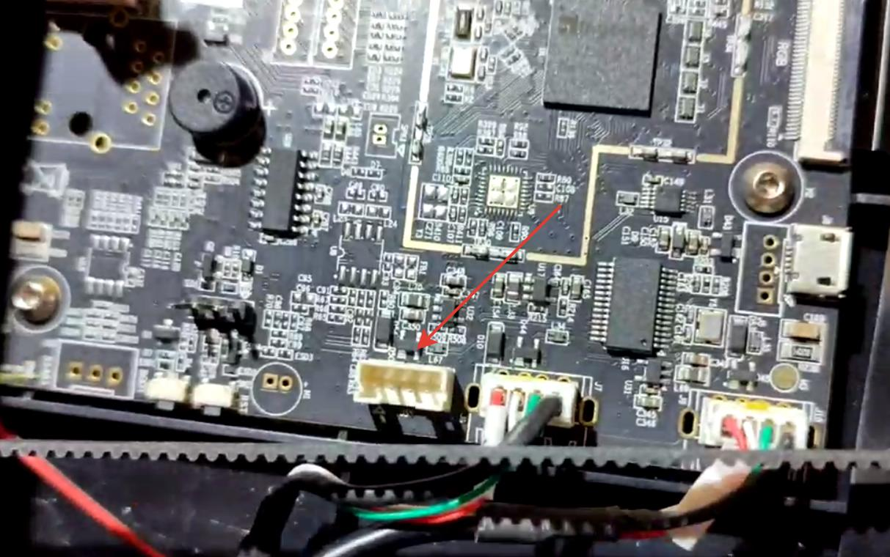
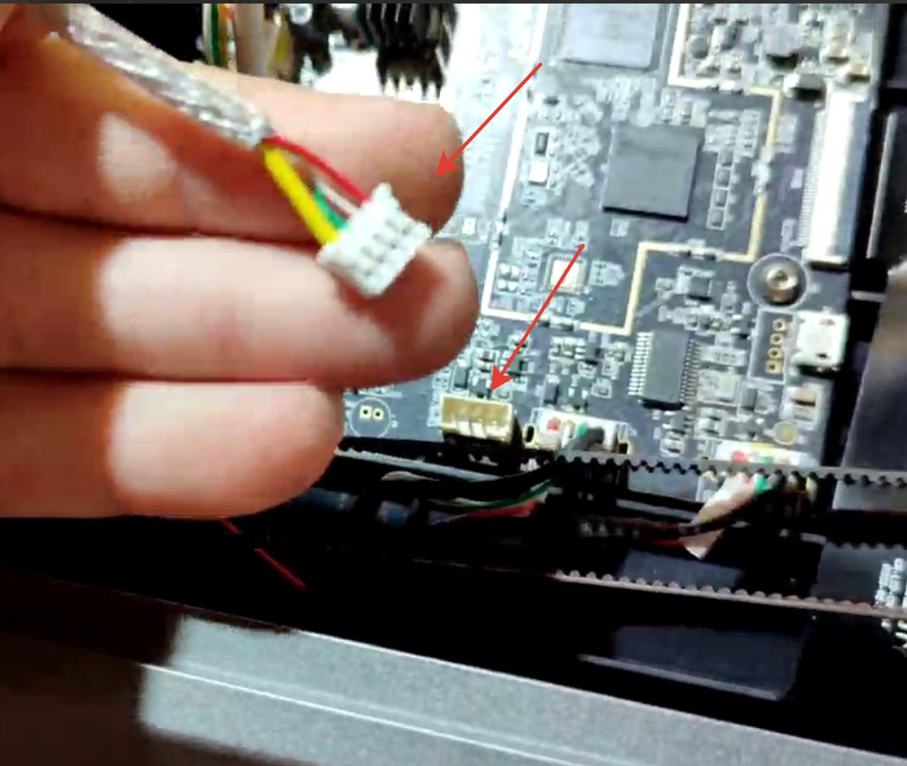
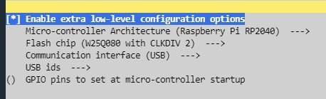
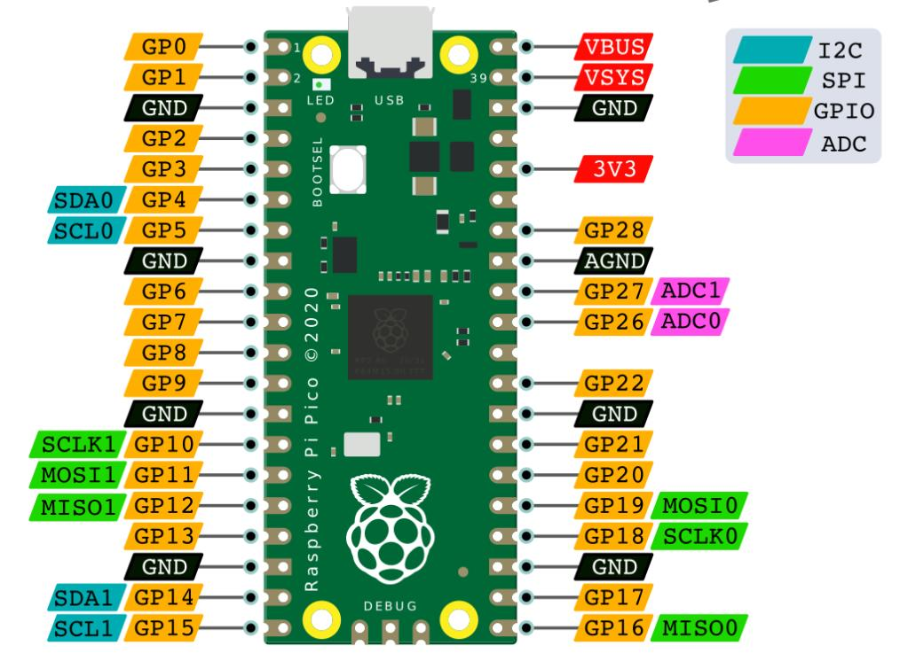

<h3 align="right"><a href="https://www.tinkoff.ru/rm/yakovleva.irina203/51ZSr71845" target="_blank">ваше "спасибо" автору</a></h3>

**Подключение raspbery pico к принтеру**

Основным препятствием в ваших самоделках может быть отсутствие свободных пинов на материнской плате принтера, данный мануал даст вам возможность добавить их некоторое количество с помощью подключения дополнительного mcu основанного на Raspbery pico.

**1.** Вскрываем днище нашего корпуса принтера.


**2.** Находим свободный юсб разъем на плате. *Свободный он у пользователей к1\к1с но и пользователям к1макс обычно он не нуден так как задействован под лидар который все  снимают*



**3.** Обжимаем разьем из любого подходящего микро юсб кабеля. *Тут сделаю небольшую ремарку, вывести кабель я предлагаю на заднюю стенку принтера, благо там есть и кабель каналы и отверстия подходящие,  Можно вывести не просто разьем microUSB а полноценный хаб на 2-4 разьема, его и проверить легче - определилась вставленная флешка - значит все соединено правильно.* 



**4.** Теперь нам нужно прошить нашу pico. На самом принтере это сделать проблематично поэтому есть несколько вариантов поставить klipper на другую подходящую железку и  в меню выбрать:



ну или не мучаться и скачать готовую прошивку [**тут**](klipper.zip) не забудьте распаковать файл.

**5.** Прошиваем:

 UF2 режим можно активировать удерживанием кнопки BOOTSEL при подачи питания по USB. Появится накопитель «RPI-RP2», который можно использовать для копирования бинарных файлов uf2.

**6.** Подключаем к разьему.

Зайдя на наш принтер по ssh выполняем:

```
ls /dev/serial/by-path/* (также можно использовать /dev/serial/by-id/)
```

должны увидеть что-то типа такого:

```
 /dev/serial/by-id/usb-Klipper_rp2040_E660B4404B3EAB35-if00
```

если не увидели то возможные варианты:

 - плохой кабель
 
 - неправильно сделан разьем.


**7.** В нашем printer.cfg в любом удобном месте добавляем строки:


```
[mcu pico]
serial: /dev/serial/by-id/usb-Klipper_rp2040_E660B4404B3EAB35-if00
```
где после `serial:` идет та  строка что мы получили в предыдущем пункте.

Теперь у нас все готово для добавления наших пинов в наши проекты. 



После прошивки и конфигруации MCU Raspberry Pico сразу предоставляют доступ к своим pin. Единственным условим их корректного использования будет четкое указание к какому Pin идет обращение, например, у нас есть MCU Pico
```
[mcu pico]
serial: /dev/serial/by-id/usb-Klipper_rp2040_E660B4404B3EAB35-if00
```

Обращение к его 'Pin' внутри конфигурационного файла будет выглядеть следующим образом:

```
pico:gpio1
```

Например - конфиг для датчика толщины филамента будет выглядеть так:

```
[hall_filament_width_sensor]
adc1: pico:gpio26
adc2: pico:gpio27
cal_dia1: 1.48
cal_dia2: 1.99
raw_dia1: 8750
raw_dia2: 9175
default_nominal_filament_diameter: 1.75
max_difference: 0.150
measurement_delay: 665
enable: True
logging: True
measurement_interval: 5
```

Подключить светодиодную ленту можно например так:

```
[neopixel pico]
pin: pico:gpio16
#color_order: GRB
initial_GREEN: 0.5
```

Вообще с пинами можно делать много чего например включать и выключать (подробно можно почитать в [klipper referense](https://github.com/Klipper3d/klipper/blob/master/docs/Config_Reference.md#output_pin)), снимать с них данные. 

Вид данных по типу смотрите по картинке подсказке выше. если вы пытаетесь подключить датчик i2s не стоит его пихать в обычный gpio тоже самое с данными spi.   


