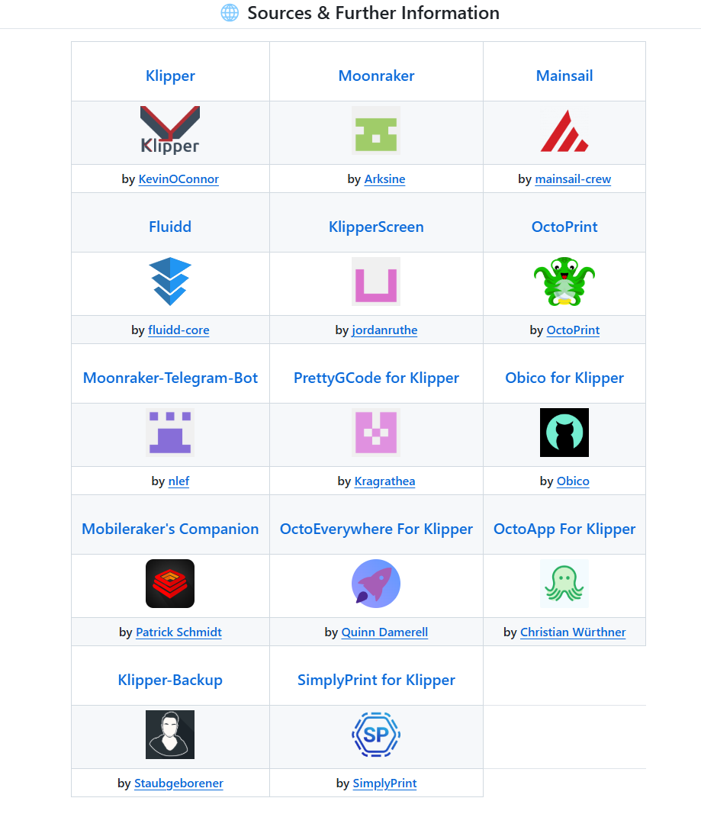
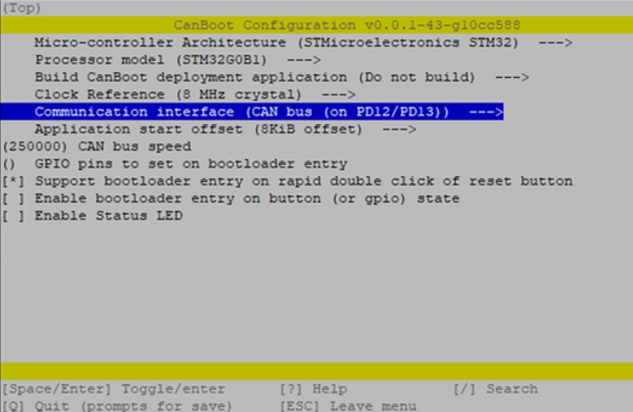

<h1>Прошивка klipper</h1>

Впервые была представлена в 2016 году Кевином О'Коннором в качестве прошивки 3D-принтера для выполнения высокоскоростной 3D-печати.

Сегодня современный принтер невозможно представить без прошивки klipper. продвинутые алгоритмы печати, легкость конфигурирования, различные  дополнительные сервисы, все это делает эту прошивку популярной а открытый исходной код позволяет энтузиастам добавлять  новые возможности. Даже если у вас есть принтер у которого этой прошивки нет, в большинстве случаев вы можете перейти на неё без особых проблем. Говоря о прошивке klipper мы подразумеваем не просто прошивку, а программный комплекс в котором есть несколько модулей, как и любой открытый проект эти модули развиваются самостоятельно и со временем обогащаются новыми  функциями.

<h2>Основной состав</h2>

**Klipper** - это сердце нашего програмного комплекса который и управляет непосредственно наше железом, опрашивает датчики. вносит коррективы во время отправки G-code. Делится на две части, установленная на серверной части и установленная непосредственно на плате принтера. 

Принтерная часть довольно проста - отдает данные с датчиков, получает команды для моторов. За счет этого плата принтера не испытывает больших нагрузок и даже не обладая мощным процессором может быть быстрой. 

Серверная часть уже  занимается не только получением и передачей данных но и анализом изменением  текущего G-code с учетом различных алгоритмов и сценариев. Обычно в качестве серверной части мы используем различные одноплатные компьютеры такие как Raspberry PI или Orange PI. В последнее время производители плат предлагают свои решения уже с интегрированными одноплатниками своей разработки такие как CB1 от BTT и материнские платы такие как Manta или полностью интегрированные в материнскую плату принтера такие как Creality K1 серия. У каждого из решений есть свои плюсы и минусы с которыми придется мириться. 

**Moonraker** - модуль связной.  Предоставляет средствами API доступ к текущей информации происходящего внутри нашего програмного комплекса, позволяет получать и отправлять данные к ней. Из интересного - внутри конфигурационного файла можно использовать огромное количество настроек, например почти все дополнения используют именно moonraker для обновления своих файлов.

**Fluid, Mainsail** - виды вебпанелей, чуть отличающиеся визуально но в целом предоставляющие практически одинаковый функционал к визуальному доступу к данным. какой выберете вы это исключительно дело вкуса, обычно мы работаем с одним из них но вы можете поставить оба, составить свое личное мнение и пользоваться той которая больше вам понравится. 

<h2>Дополнительные модули</h2>

В составе установки мы можем использовать дополнительные модули если нам это необходимо, это зависит не только от наличия необходимого оборудования, например видеокамеры внутри нашего принтера, но и наших задач которые могут быть весьма различны. 

**KlipperScreen** - Да, экран для принтера теперь не является чем то обязательным. Если вы переводите старый принтер у которого экран соединен с материнской платой, вероятнее всего у вас не будет возможности его запустить, но веб интерфейс вас выручит, с другой стороны вы можете поставить экран с тачскрином практически любого размера если вам это необходимо присоеденив его к своему одноплатнику.  

**Crowsnest** - сервис стриминга для вебкамеры. это очень удобно, главное чтобы камера у вас была.

**Telegram Bot** - сервис уведомлений в телеграм бот вовремя предупредит о проблемах, даст вам возможность как запускать на печать так и контролировать печать во время ее выполнения, главное - правильно настроить.

**Gcode shell commands** - очень часто упускают из внимания этот внешне непримечательный модуль, он позволяет исполнять команды линукс и даже целые скрипты из оболочки клиппер, но *предупреждение
Это расширение может иметь высокий потенциал для злоупотреблений, если его использовать неаккуратно! Кроме того, в зависимости от выполняемой вами команды, могут возникнуть высокие нагрузки на систему, что может привести к ее нестабильности. Используйте это расширение на свой страх и риск и только если вы знаете, что делаете!*

<h2>Установка Klipper</h2>

Установку операционной системы на примере Orange PI мы рассмотрели ранее, вы можете прочитать это [тут](https://3d-diy.ru/blog/ustanovka-os-na-orange-pi-3-lts/)

**Klipper Installation And Update Helper** - он же **KIAUH**

Самый популярный установщик на данный момент который требует минимальной подготовки и позволяет поставить модули не мешая друг другу  быстро и эффективно. На представленном ниже скриншоте мы видим количество интегрированных модулей в установщик.




Наиболее свежую информацию по установщику всегда можно найти на его странице https://github.com/dw-0/kiauh/tree/master  

**Отказ от ответственности: использование этого скрипта происходит на ваш страх и риск!**

* **Шаг 1:** \
Чтобы загрузить этот скрипт, необходимо установить git. Если у вас еще не установлен git или вы не уверены, выполните следующую команду:
```shell
sudo apt-get update && sudo apt-get install git -y
```

* **Шаг 2:** \
После установки git используйте следующую команду для загрузки KIAUH в свой домашний каталог:

```shell
cd ~ && git clone https://github.com/dw-0/kiauh.git
```

* **Шаг 3:** \
Наконец, запустите KIAUH, выполнив следующую команду:

```shell
./kiauh/kiauh.sh
```

* **Шаг 4:** \
Теперь вы должны оказаться в главном меню KIAUH. Вы увидите несколько действий на выбор в зависимости от того, что вы хотите сделать. Чтобы выбрать действие, просто введите соответствующий номер в строку «Выполнить действие» и подтвердите, нажав ENTER.

Для работы нам нужно установить пункты **klipper**,  **moonraker** и одну из вебпанелей на выбор **Fluid** или **Mainsail**. 

*Отдельно отмечу что выбирать надо Python 3.xx так как практически все модули используют уже давно его, а не устаревший 2.7 однако во многих руководствах продолжают писать про необходимость ставить устаревший python.* 


Если у вас будет использоваться экран то установите **klipperscreen**


Проверьте статус их установки на интерфейсе KIAUH. Все пукты которые вы поставили должны быть обозначены как «Установлено».


Второй частью нашей задачи будет создание и прошивка материнской платы принтера. это сделать достаточно просто, достаточно ввыести команды: 

```shell
cd ~/klipper
make clean
make menuconfig
```
и мы окажемся в меню выбора нашей платы. однако здесь уже надо знать  дополнительную информацию. чип нашей платы, тип загрузчика, тип  соединения и его скорость. 

например так: !!!Исключитально для примера!!!




Выбрав вышеуказанные настройки, выходим из конфигуратора, сохранившись нажав **Q** и **Y** на предложение сохранить

Далее нам надо собрать прошивку. Для этого последовательно запускаем две команды и ждем их выполнения
```
make clean

make
```
Переходим в каталог, в который скомпилировалась прошивка cd `~/klipper/out` и смотрим там листинг файлов `ls -la`. Там должен быть файл с именем **klipper.bin**. Скачиваем его к себе по scp или sftp. 

*Для некоторых плат, файл придется переименовать особым образом, наиболее универсальный вариант это **firmware.bin**.* 

 Загружаем получившийся файл на флешку, выключаем принтер, вставляем в него флешку, включаем... ждем пару минут для уверенности, хотя обычно прошивка занимает меньше 30 секунд, выключаем принтер и вынимаем флешку. Прошивка платы принтера завершена. 

 У нас есть установленное ПО на серверную и на принтерную часть, чтобы их подружить и рассказать нашему принтеру как и с чем работать необходимы конфигурационный файлы и как дом начинается от печки наш конфиг начинается с файла **printer.cfg**

 Предполагается что вы уже соединили плату принтера с одноплатником через USB или UART и включили обоих. 

 для начала в консоли нашего одноплатника:

 `ls /dev/serial/by-path/*` (также можно использовать `/dev/serial/by-id/`)

 если все соединено верно то вы увидите что то похожее:

 `/dev/serial/by-path/platform-5101400.usb-usb-0:1:1.0`

 в printer.cfg в раздел mcu мы как раз и впишем найденное значение примерно так. !!!Исключитально для примера!!! 

```
[mcu]
serial: /dev/serial/by-path/platform-5101400.usb-usb-0:1:1.0 
restart_method: command
```

таким образом мы можем наладить связь нашей платы с нашей серверной частью прошивки.

 Дальнейшее взаимодействие зависит от вида кинематики, от вида материнской платы принтера, количества моторов и датчиков, нагревателей которые описываются в файле `printer.cfg` 
 
 Также там можно описать различные сценария и действия во время печати до и псле нее с помощью макросов. все это уже зависит от конкретных условий и не может быть рассмотрено в данной статье.