<h2>Установка OS на Orange Pi 3 LTS</h2>
Orange Pi 3 LTS — это очень компактный одноплатный компьютер, оснащенный двухдиапазонным WiFi и Bluetooth 5.0. Он может работать под управлением различных дистрибутивов таких как Ubuntu или Debian. 

Основным его преимуществом кроме небольшой цены, является наличие встроенной памяти EMMC, так что ОС хранится на самой плате и обладает большим быстродействием чем вариант с sd-картой или накопителем USB. Если мы рассматриваем плату как мозг нашего будущего принтера 2Гб оперативной памяти и 8 Гб EMMC нам вполне хватит.

нам понадобится:

[Orange Pi 3lts](https://aliexpress.ru/item/1005003577312703.html)

[Блок питания usb-c не менее 2А, а лучше 3А](https://aliexpress.ru/item/1005002347297314.html)

Желательно - [радиаторы для OPi3lts](https://aliexpress.ru/item/1005004139227052.html)

Sd карта 8-16Гб рекомендуется большинством мануалов, однако для небольших дистрибутивов сойдет и 4Гб

[адаптер USB-SD](https://aliexpress.ru/item/1005007039249156.html)

Для связи и первоначальной настройки нам либо нужен монитор клавиатура и мышка, или, что проще, найти в хозяйстве Lan-кабель и роутер который выдаст нам ip-адрес по которому мы проведем необходимые настройки, включая wifi соединение. 

Первый шаг — загрузить образ OS и записать его на SD-карту. Мы загрузим Orange Pi 3 LTS с этой SD-карты, а затем установим ОС на хранилище eMMC.

Перейдите на [страницу загрузок Orange Pi](http://www.orangepi.org/html/hardWare/computerAndMicrocontrollers/service-and-support/Orange-pi-3-LTS.html) и выберите OS. 

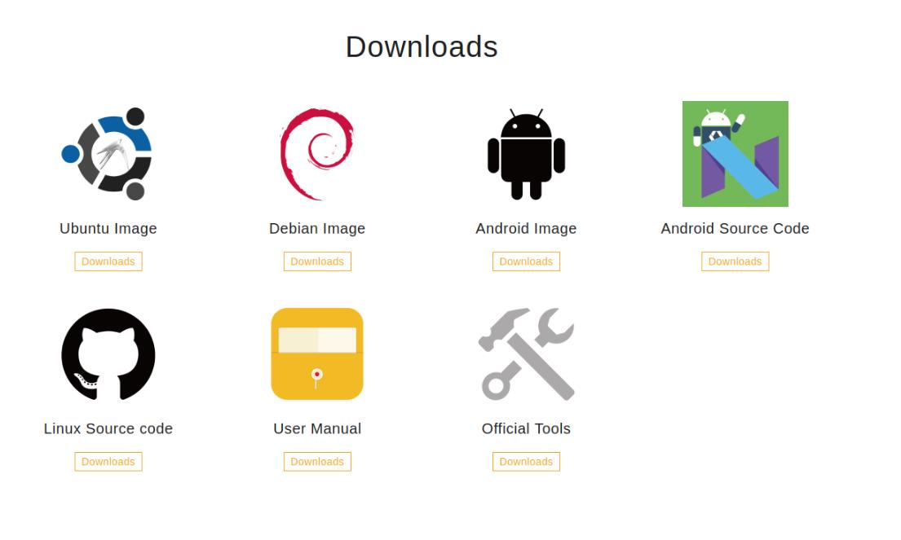

Вы можете выбрать как Debian так и Ubuntu, кому как больше нравится рассматривать дальнейшие действия мы будем на образе Debian. *нет смысла брать образы с графическим интерфейсом, чем меньше образ тем лучше.*

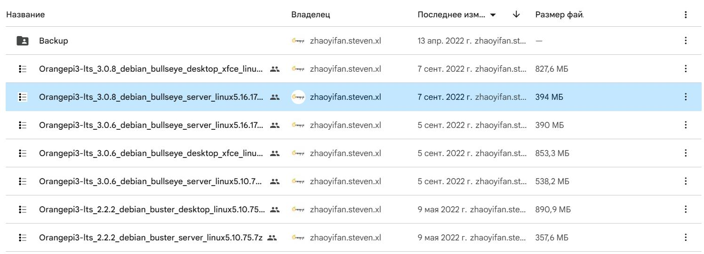

Для записи образа на карту памяти нам понадобиться [BalenaEtcher](https://etcher.balena.io/)

Выберите образ Orange Pi OS.

Нажмите «Прошить из файла» и выберите образ ОС, файл образа системы и нажмите "Flash!"

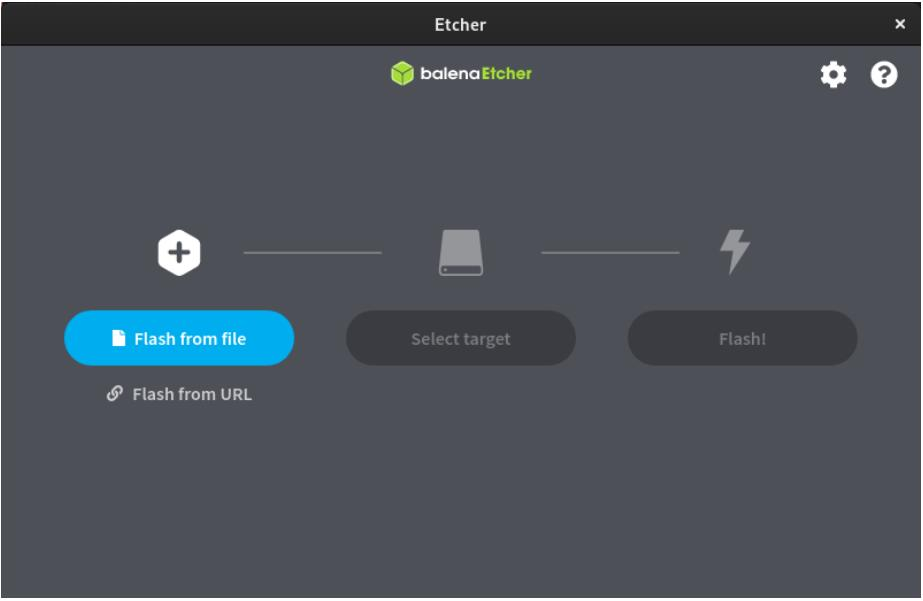

Пошаговую инструкцию по прошивке можно найти на [сайте BalenaEtcher](https://sbc-community.org/docs/general_guides/prepare_sd_card/) и в ней нет ничего сложного. 

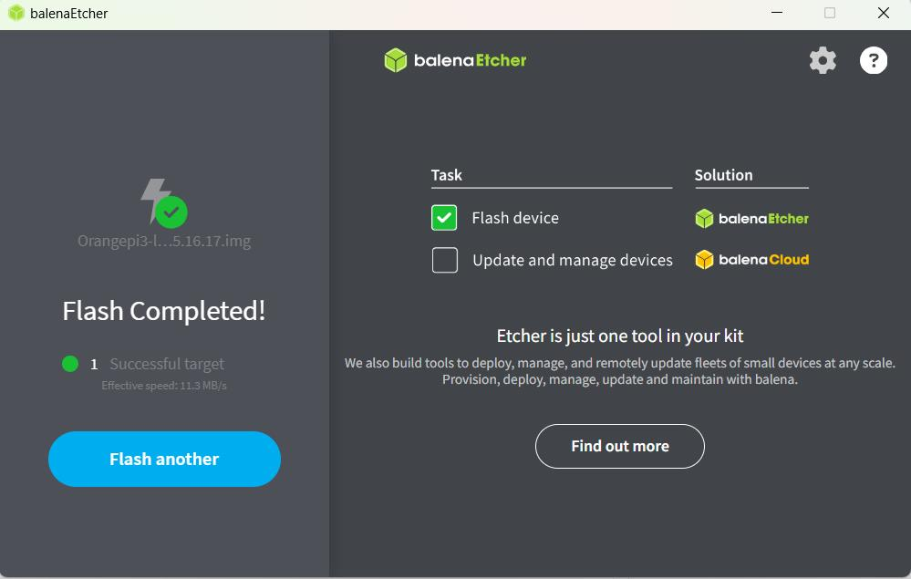 

После завершения карту можно извлечь и вставить непосредственно в OPI3lts.

Включаем подключаем блок питания вставляем Lan кабель в роутер и ищем ip-адресc нашего устройства среди подключенных. Где-то через пару минут на роутере среди подключенных устройств появится `orangepi3-lts`.   

На компьютере с windows жмем Win+R в открывшемся окне пишем `cmd` в появившемся окне пишем `ssh root@ip-адрес` нашего устройства. Например так `ssh root@192.168.1.101`

На вопрос: `Are you sure you want to continue connecting (yes/no/[fingerprint])?` пишем `yes` чем  соглашаемся на запоминание ключа и на предложение пароля вписываем `orangepi`

*Если роутера под руками нет но есть монитор HDMI и usb клавиатура и мышь то подключаем их  и включаем OPI3lts  в сеть. В появившемся окне После загрузки войдите в систему, используя имя пользователя `root` и пароль `orangepi`*

<h3>Перенос операционной системы на внутреннюю память EMMC</h3> 

Введите `nand-sata-install`, чтобы начать процесс установки
Выберите загрузку с eMMC, примите предупреждение о том, что процесс удалит все содержимое памяти eMMC, выберите EXT4, затем начнется процесс переноса длящийся около 2-5 минут. 

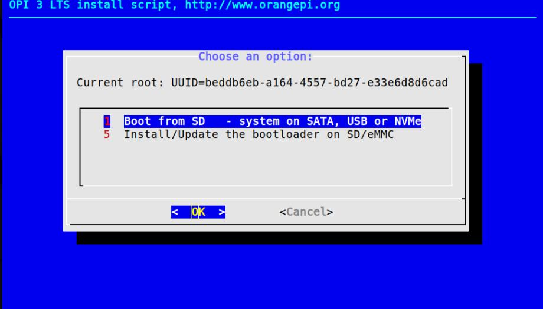

По окончанию процедуры вам надо будет  выключить плату. Сделайте это и извлеките SD-карту.
Установка Linux на eMMC завершена.

<h3>Прочие настройки</h3>

После перезагрузки по питанию, мы можем продолжить настройку. Для этого снова открываем терминал на компьютере Win+R `cmd` в открывшемся окне `ssh root@ip-адрес` вписываем пароль `orangepi`.

Как видно из примера картинки нам предлагают обновится и провести настройки. Не будем отказываться от обоих предложений. пишем `apt update` после обновления списка пакетов пишем `apt upgrade -y` и ждем пока пакеты обновятся.

Пишем `orangepi-config` и попадаем в меню настройки:

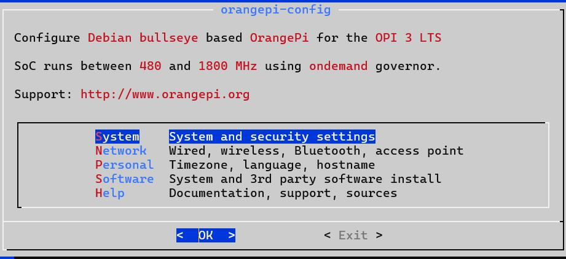

Выбираем меню `Personal`

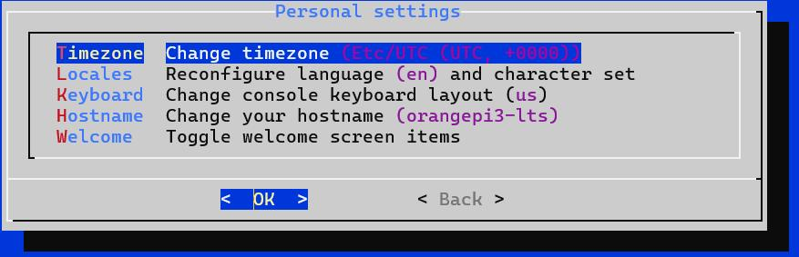

Выбираем свою Временную зону `Europe` и ищем ближайший к нам город из списка. жмем `Ok`

Выбираем локаль: 

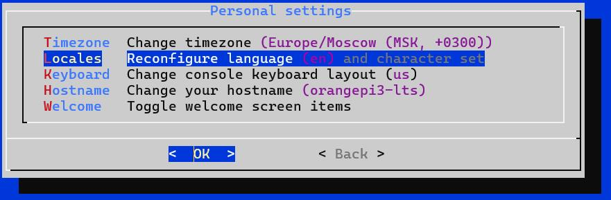

*оптимально будет ru_RU.UTF8 что поможет избежать ошибок кодировки кириллицы.*

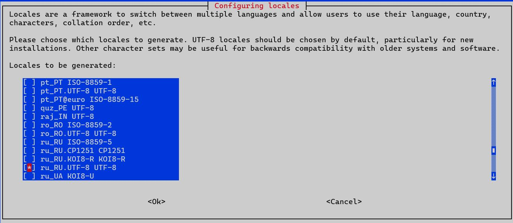

В следующем окне нам будет предложено на каком языке с нами будет общаться в дальнейшем система, удобно выбрать русский язык, чтобы легче было понимать сообщения от нее. 

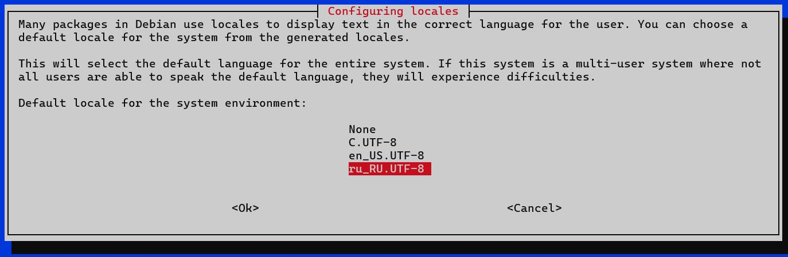

Если у вас предполагается много аналогичных устройсв в одной локальной сети тогда имеет смысл дать нашему устройству уникальное имя через пункт меню `Hostname`. Если нет, этот пункт можно пропустить.

Выходим в главное меню и выбираем `Network`где выбираем `WIFI`

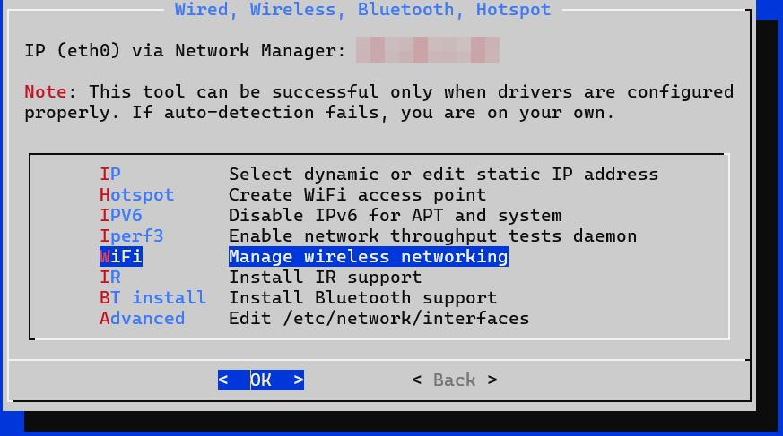

Находим свою сеть и вписываем пароль. После этого выходим из всех меню в консоль где набираем `reboot` Lan кабель можно отключать. при подключении через WIFI одноплатник получит другой Ip-адрес На роутере находим наш одноплатник и при желании закрепляем его IP адрес. 

Из необязательного:

Через меню `System` можем обновить файлы прошивки самого устройства:

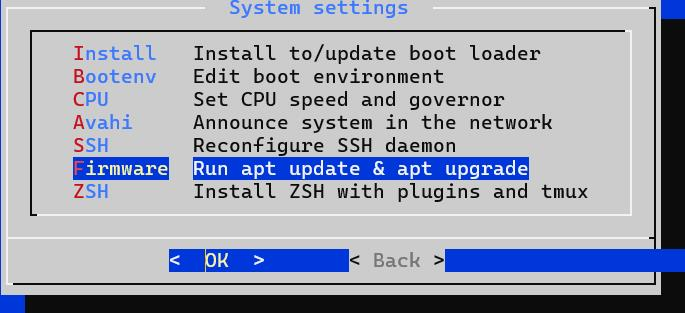

По умолчанию кроме `root` у нас есть еще пользователь `orangepi` с паролем `orangepi` дальнейшую настройку мы будем проводить уже от него. 

