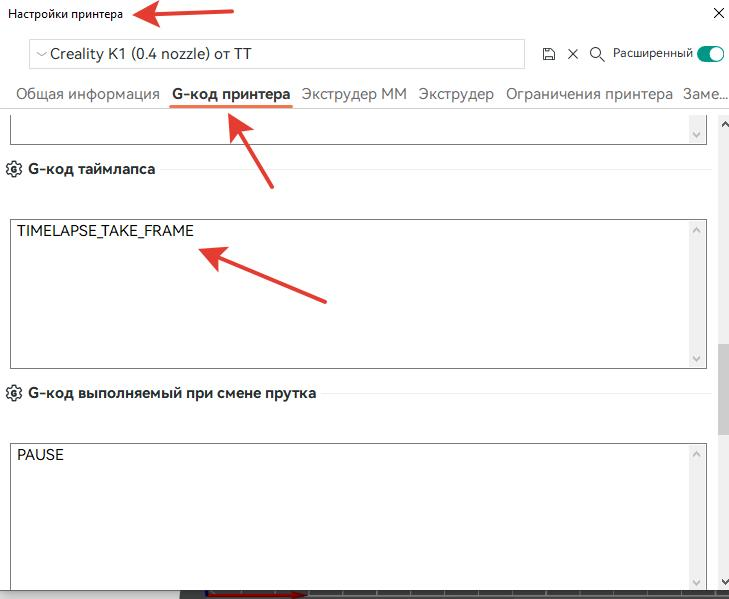
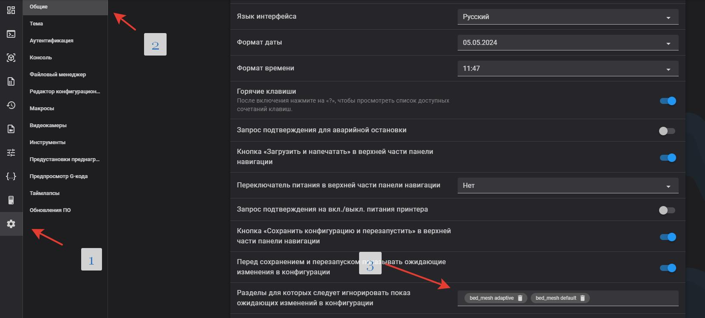

<h3 align="right"><a href="https://www.tinkoff.ru/rm/yakovleva.irina203/51ZSr71845" target="_blank">ваше "спасибо" автору</a></h3>
<h3 align="right"><a href="https://t.me/tombraider2006" target="_blank">телеграм канал автора</a></h3>


  <h1>Инструкция к прошивке 1.3.3.46</h1>

*Ремарка: Наибольшая функциональность на данной момент реализована на прошивке [**SimpleAF**](/version_config/SimpleAF.md) - не подходит для Sfc kit*
 
1. **рекомендую** если у вас были ранее установлены скрипты перед установкой сбросить прошивку до заводских настроек для исключения накладок.

   сначала ставим   [**HELPER SCRIPT**](https://guilouz.github.io/Creality-Helper-Script-Wiki/helper-script/helper-script-installation/) рекомендованные пункты:

      1, 2, 4, 5, 6, 7, 8, 9, 10, 11, 12, 16

      прочитать про каждый из пунктов можно [**тут**](/random/menu.md)

2.  перезагружаем принтер по питанию. все работает. 

3. если у вас установлена камера- в настройках fluidd - камеры - добавить - пишем любое имя - жмем ок. переходим а настройки интервальной сьемки - выбираем нашу камеру. 

<h3>Баги установки</h3>
   
   Если во время установки moonraker начинает ругаться на сертификат,  перед установкой скрипта поставьте свой часовой пояс а потом обновите время - `hwclock -w` .
   
   проверить правильность даты и времени можно проверить командой `date`

   Недавно выявлен еще один баг. На команду клонирования с гита появляется ответ `error: Couldn't resolve proxy` Лечится командой:

   ```
   git config --global --unset http.proxy
   ```

<h2>калибровки после установки.</h2>
 
 про полезные макросы читаем [**тут**](/macros_helpfull/readme.md)

 про калибровки шейперов читаем [**тут**](/shaper/readme.md)

 про калибровки ремней читаем [**тут**](/random/belts/readme.md)

**Для калибровок соркина на откаты и ЛА\ПА нужны такие стартовые и конечные коды**


стартовый код
```
_FULL_BED_MESH_ON
_ADAPTIVE_PURGE_LINE_OFF
START_PRINT EXTRUDER_TEMP=$HOTTEMP BED_TEMP=$BEDTEMP

```

конечный код

```
SET_PIN PIN=FULL_BED_MESH VALUE=0
_ADAPTIVE_PURGE_LINE_ON
END_PRINT

```


пройти тесты можно [**ТУТ**](https://k3d.tech/calibrations/)

<h2>что вы получите?</h2>

  флюид и мунрейкер - (отправка на печать из любого слайсера по wifi), таймлапсы, бипер в конце печати при паузе и при сработке датчика обрыва филамента, добавлены графики шейперов, натяжки ремней, сохраняется зет офсет при перезагрузке, тест на определенной частоте для определения резонируещих частей принтера , изменена логика кулеров, адаптивная сетка стола теперь с правильным макросом старта печати - если нет исключения обьектов будет рисовать боковую линию прочистки стандартную. также добавлен макрос *screws calibration* если вы решите использовать модификацию с барашками стола для их полуавтоматической настройки.  

ОБЯЗАТЕЛЬНО!!! провести тесты  шейперов и  PID экструдера!!!

**Если установили таймлапс, не забудьте прописать его в настройках орки**



```
TIMELAPSE_TAKE_FRAME
```

**если возникает проблема с загрузкой Fluid или Mainsail** необходимо доустонавить еще компонент 

```
opkg install wget-ssl
```


мой выбор программы доступа по ssh  из  windows это: [**Bitvise SSH Client**](https://www.bitvise.com/ssh-client-download)

**чтобы после каждой печати  вас не раздражала надпись "сохранить настройки и перегрузить"**

 можно выполнить три простых пункта. зайти в настройки перейти в общие и добавить исключения. `bed_mesh adaptive` и `bed_mesh default`




**Небольшое замечание касательно KAMP.**

Он включает в себя две функции - адаптивную карту стола и макрос линии прочистки сопла.
Адаптивная карта стола не совместима с несколькими функциями, требующим построения полной карты стола.
В их число входит калибровка PA при помощи лидара и штатная линия прочистки сопла на левом краю стола, которая включается если отключена адаптивная линия прочистки из KAMP. Ни в коем случае не отключайте линию прочистки, если у вас включена адаптивная карта стола - это может привести к повреждению покрытия стола (хотя куда более вероятно простое налипание пластика на сопло из-за того, что оно слишком далеко от стола).

Точность калибровки лидаром также подвергается сомнению, вследствие чего чаще всего его рекомендуется просто отключить (вплоть до физического удаления с печатной головки принтера).

Также, если у вас используется мультиматериальная система (ERCF, TradRack, MMU, CFS и им подобные) - обратите внимание, что башня очистки не получает своего названия объекта и из-за этого на неё не распространяется область построения карты стола - пожалуйста, планируйте её размещение так, чтобы она попадала между другими объектами 


### Новый алгоритм измерения Input Shaping

Прочитать про отличия нового от старого алгоритма можно [**тут**](https://klipper.discourse.group/t/a-bit-different-resonance-test/17227)

Чтобы его применить заходим по ssh и копируем следующий блок:

```
cd /usr/share/klipper/klippy/
mv toolhead.py toolhead.py.bak
rm toolhead.pyc
wget -P /usr/share/klipper/klippy/ https://raw.githubusercontent.com/Konstant-3d/K1C-mods/refs/heads/main/usr/share/klipper/klippy/toolhead.py
chmod 644 toolhead.py
cd /usr/share/klipper/klippy/extras/
mv resonance_tester.py resonance_tester.py.bak
mv shaper_calibrate.py shaper_calibrate.py.bak
rm resonance_tester.pyc
rm shaper_calibrate.pyc
wget -P /usr/share/klipper/klippy/extras/ https://raw.githubusercontent.com/Konstant-3d/K1C-mods/refs/heads/main/usr/share/klipper/klippy/extras/resonance_tester.py
wget -P /usr/share/klipper/klippy/extras/ https://raw.githubusercontent.com/Konstant-3d/K1C-mods/refs/heads/main/usr/share/klipper/klippy/extras/shaper_calibrate.py
chmod 644 resonance_tester.py
chmod 644 shaper_calibrate.py
sed -i 's/accel_per_hz: 75/accel_per_hz: 60/' /usr/data/printer_data/config/printer.cfg
reboot
```
после введения данных команд принтер перезагрузится и у вас будет новый алгоритм
### Для K1SE с прошивкой 1.3.5.11
По неведомой причине для данной прошивки необходим немного другой файл. Решение уже найдено, чтобы его применить вам, и только вам!, на других прошивках и принтерах работать не будет, необходимо в консоль ssh дополнительно к основному скрипту, скопировать следующие команды:

```
cd /usr/share/klipper/klippy/
mv toolhead.py toolhead.py.bak1
wget -P /usr/share/klipper/klippy/ https://raw.githubusercontent.com/Konstant-3d/K1C-mods/refs/heads/main/usr/share/klipper/klippy/toolhead_1_3_5_11.py
mv toolhead_1_3_5_11.py toolhead.py
chmod 644 toolhead.py
reboot
```
после введения данных команд принтер перезагрузится и у вас будет новый алгоритм


<h4>Guppy Screen update</h4>

Исправленная версия GuppyScreen:

1. Пересобраны шрифты, используется NotoSans-Medium, включено subpx-сглаживание, поддерживается кириллица.
2. Изменены значения экструда на экране Extrude, выставлены более удобные в реальной жизни значения.
3. Поправлено обрезание статуса файла нижними кнопками на панели Print.
4. Поправлен выпадающий список Display sleep в настройках Guppy.
5. В сборку попало исправление остатка прутка в Spoolman, а так же должны работать usb-флешки.

Установка скриптом из helper-script:

1. Открыть скрипт на редактирование `/usr/data/helper-script/files/guppy-screen/guppy-update.sh`
Найти строку `"$CURL" -s https://api.github.com/repos/ballaswag/guppyscreen/releases -o /tmp/guppy-releases.json` и исправить слово `ballaswag` на `neonman63`
2. Запустить скрипт `sh /usr/data/helper-script/files/guppy-screen/guppy-update.sh`

Установка обновления вручную:

1. Закинуть архив любым способом в каталог /usr/data, например:
```
wget 'https://github.com/neonman63/guppyscreen/releases/download/nightly/guppyscreen.tar.gz' -O /usr/data/guppyscreen.tar.gz
или
scp guppyscreen.tar.gz root@ip-printer:/usr/data/
tar -xvf /usr/data/guppyscreen.tar.gz -C /usr/data/guppyscreen/..
/etc/init.d/S99guppyscreen stop
killall -q guppyscreen
/etc/init.d/S99guppyscreen restart
rm -f /usr/data/guppyscreen.tar.gz
```
Enjoy!


 вот  [**конфиги посмотреть**](/version_config/1_3_3_36/) в комментариях в файлах printer.cfg и gcode_macro.cfg можно увидеть какие параметры я менял и прочитать зачем.
   *это конфиг для стокового к1 с заменой шкивов и моторов. (в printer.cfg указаны строки где и что менять в 4 местах при замене на 20-зубые шкивы)*


## Ошибка 3002. Для всех кто обновился не удалив хелпер скрипт. 

заходим по ssh  и пробуем 
```
/etc/init.d/S58factoryreset reset
```
После выполнения ваш принтер запустится со сбросом настроек до значений по умолчанию, сохранятся только пользовательские настройки и параметры подключения.

если не помогло и вылазит ошибка
```
echo "all" | nc -U /var/run/wipe.sock
```
После выполнения появится сообщение `ok`, и принтер перезагрузится, а настройки будут сброшены до значений по умолчанию.

Необходимо повторно подключить принтер к сети с помощью экранного интерфейса пользователя Settings→ Network tab.

после сброса включаем root и заново накатываем хелпер скрипт
```
git clone https://github.com/Guilouz/Creality-Helper-Script.git /usr/data/helper-script
```
И введите эту команду для запуска скрипта:
```
sh /usr/data/helper-script/helper.sh
```


###  порядок установки если вам нужен более новый клиппер(устарело)

  Действия, которые нужно сделать:

1. Сбросьте настройки до заводских результатов
2. Убедитесь, что у вас установлена ​​последняя версия прошивки
3.Получите права root на компьютере
4. Установите пакет Fluidd, Moonraker и менеджер Entware только с https://guilouz.github.io/Creality-Helper-Script-Wiki/
5. Обновите Klipper до более новой версии, следуя инструкции по адресу: https://github.com/K1-Klipper/installer_script_k1_and_max
6. Вернитесь и установите дополнительные вспомогательные скрипты с помощью установщика вспомогательных скриптов Guilouz
7. в printer.cfg найти раздел `[printer]` в нём удалить строчку  `max_accel_to_decel` и заменить эту строчку на `minimum_cruise_ratio: 0.5`
Это даст вам Klipper от **~8 апреля 2024.**

на данный момент проект приостановлен и врядли будет обновлятся далее. 


   <h5 align="right">поставьте "звездочку" проекту. так другим пользователям легче его найти.</h5>
