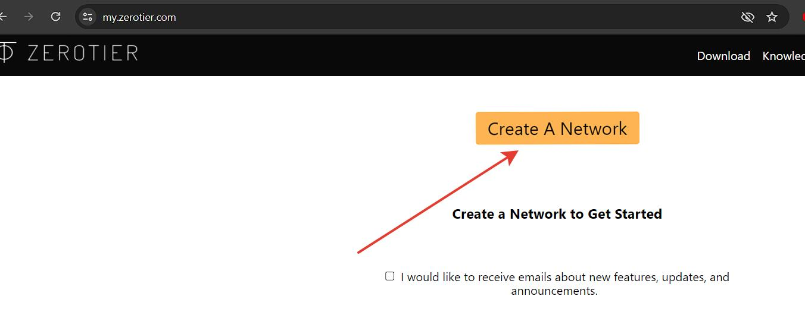
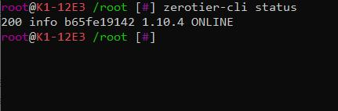
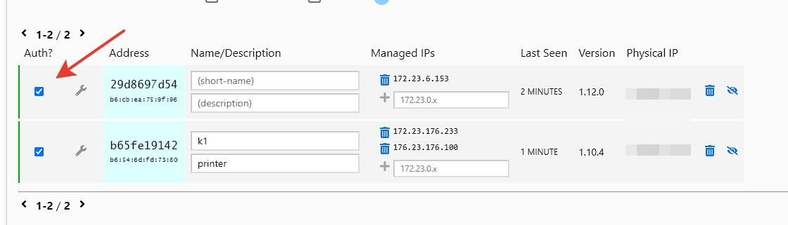

<h1>Настройка удаленного доступа к принтеру</h1>


Чтобы иметь удаленный доступ к принтеру и не платить на каждом шагу за непонятно что есть путь поднять впн с помощью сервиса zerotier. 

1. У вас должен быть установлен пакет ENTWARE из HELPER-SCRIPT 
2. устанавливаем пакет 
   ```
    opkg install zerotier
    zerotier-one -d
    cd /usr/data/printer_data/config/Helper-Script/shapers-configs/scripts
    wget --no-check-certificate https://raw.githubusercontent.com/Tombraider2006/K1/main/zero.sh
    chmod +x /usr/data/printer_data/config/Helper-Script/shapers-configs/scripts/zero.sh
    ```
3. в printer.cfg вписываем следующий раздел
```
[gcode_shell_command zerotier]
command: sh /usr/data/printer_data/config/Helper-Script/shapers-configs/scripts/zero.sh
timeout: 600.0
verbose: True


[delayed_gcode start_vpn] 
initial_duration: 1
gcode:
    RUN_SHELL_COMMAND CMD=zerotier  
   
```

4. Регистрируем аккаунт на ZeroTier https://my.zerotier.com/ (есть вариант входа через аккаунт Google/Github/etc). Попадаем в кабинет с единственной кнопкой - Create A Network, жмём её.



Создалась сеть с рандомным названием jolly_nakamoto, его потом можно изменить. Нам нужно скопировать Netword ID.


В командной строке присоединяемся к созданной сети командой с указанием ID (в моём случае вместо ### ставлю 233ccaac2783ca90)

```
zerotier-cli join ###
```
проверим что у нас получилось:

```
zerotier-cli status

```



стартовать может с задержкой, не волнуемся..

. Возвращаемся в интерфейс, переходим в сеть, листаем вниз до списка устройств (Members) и кликаем галочку в столбце Auth?, то есть разрешаем устройству доступ в сеть. Тут же можем назвать устройство и дать ему человеческое описание. Записываем себе IP из столбца Managed IPs.


 Берём мобильный телефон, качаем в сторе приложение ZeroTier (Google Play | App Store). Открываем приложение, добавляем созданную ранее сеть по 16-значному ID (как в п.6). Больше никакие настройки трогать не требуется, нажимаем Add. Авторизуем телефон в личном кабинете сайта, как ранее сделали для принтера.

 




 Отключаемся от домашнего wifi, с мобильного интернета или другой сети открываем в браузере IP принтера, который записали в ранее для Fluidd 4408 для Mainsail 4409 указываем порт. Вы должны увидеть свой привычный интерфейс.

Браузер - это хорошо, но все же любят приложения. Настроим Mobileraker (в OctoApp аналогично). Сначала добавляем принтер в локальной сети, потом идёт в его настройки, раздел Configure Remote Connection. Здесь можно задать имя Wifi сети в которой будет локальное подключение, тогда как по кнопке пропускаем вкладки с OctoEverywhere и Obico, а Manual вписываем тот же самый IP нашего принтера. Сохраняем.


написано по мотивам https://3dtoday.ru/blogs/moscowpan/zerotier-udalyonnyi-dostup-k-printeru-na-klipper
